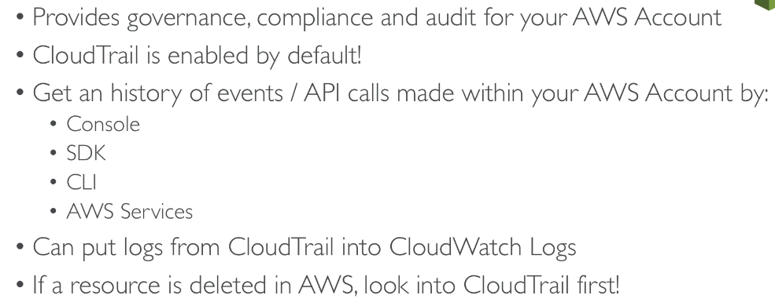

# AWS Monitoring & Audit: CloudWatch,CloudTrail & Config

## CloudWatch Metrics

### EC2 Detailed monitoring

### Custom Metrics

## CloudWatch Dashboards

## CloudWatch Logs

### Logs Metric Filter & Insights

## CloudWatch Alarms

## CloudWatch Events

## CloudTrail

## AWS Config

### AWS Config Rules

## CloudWatch Vs CloudTrail Vs Config

### For an Elastic Load Balancer

