# AWS Security & Encryption

## Encryption 101

### Why encryption?

#### Encryption in flight (SSL)

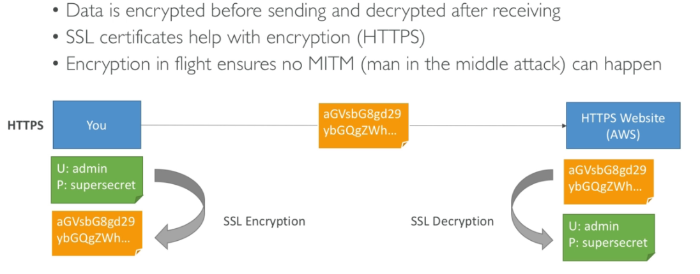

#### Server side encryption at rest

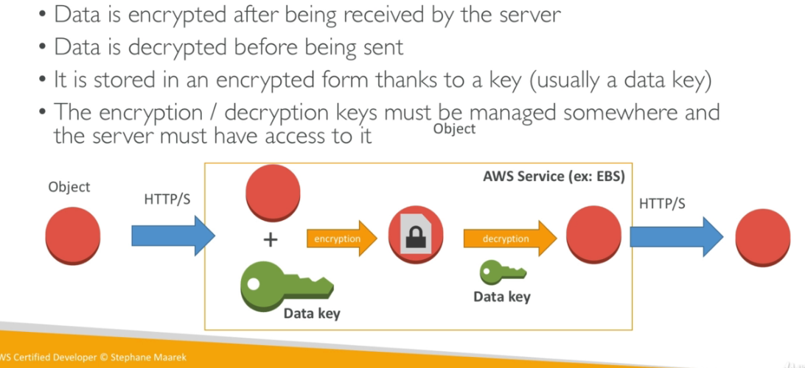

#### Client side encryption

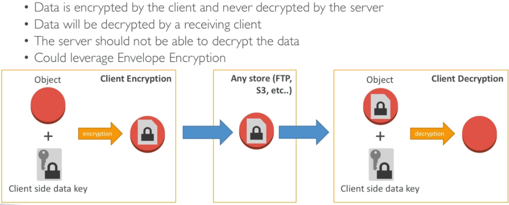

## KMS  

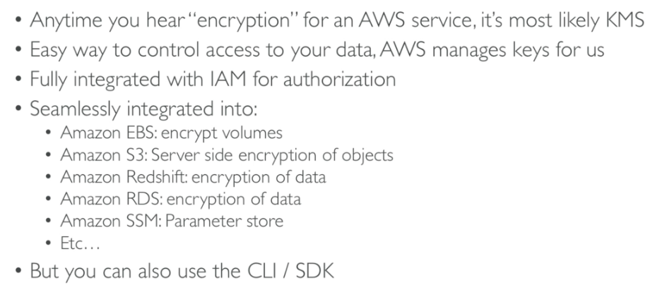

### KMS 101

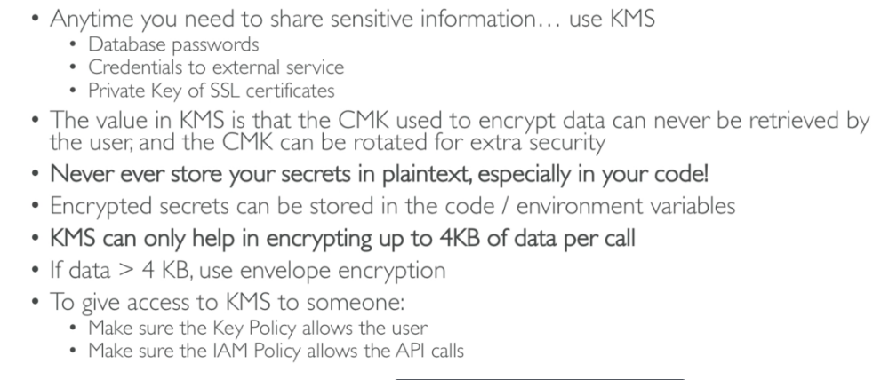

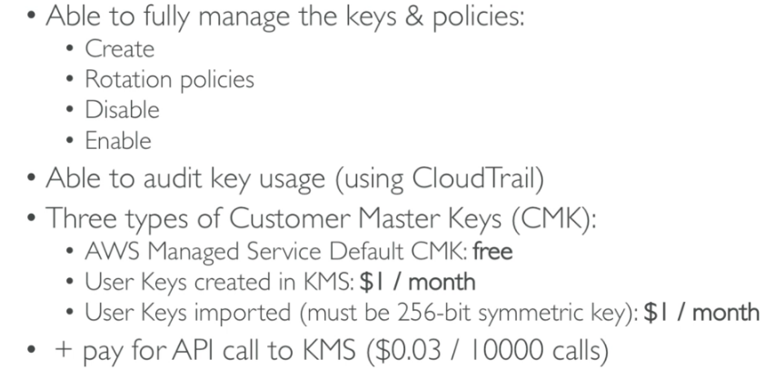

### How does KMS work?

#### API - Encrypt and Decrypt

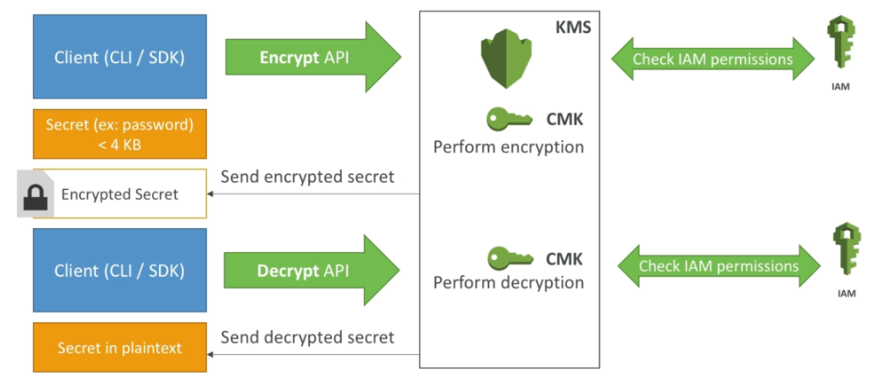

### Encryption in AWS

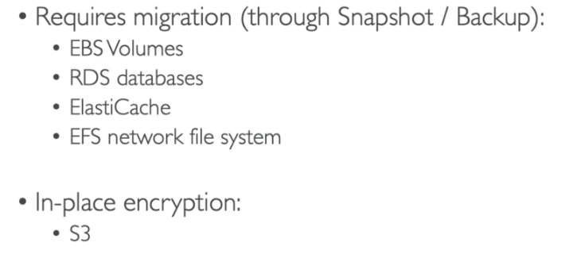

## AWS Parameter Store

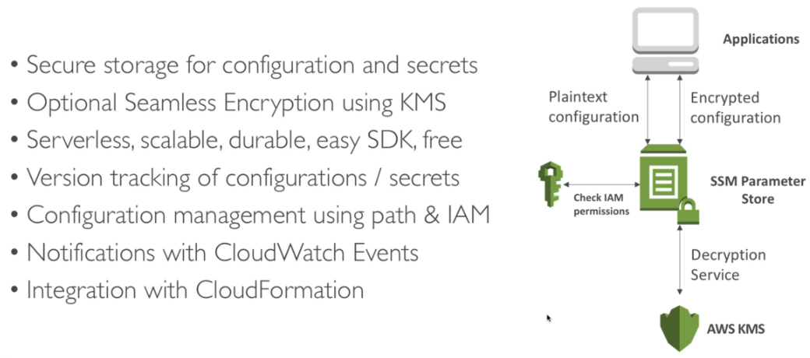

#### Hierarchy

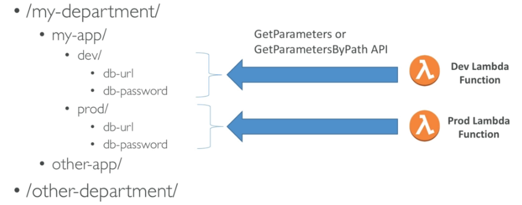

## AWS Secrets Manager

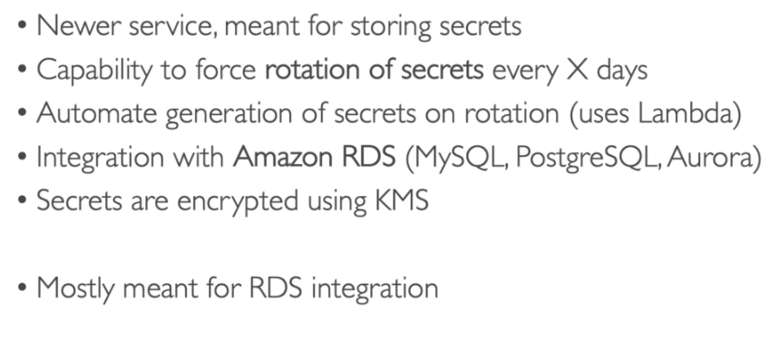

## CloudHSM

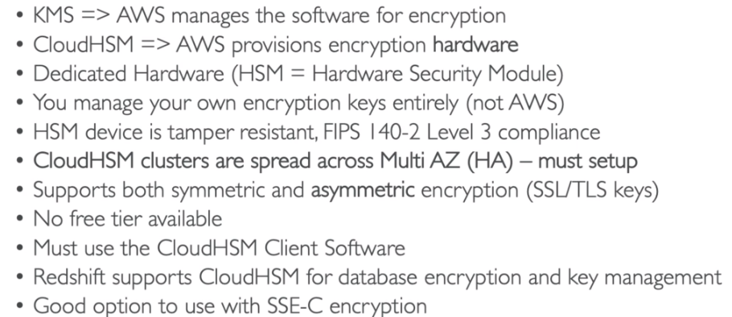

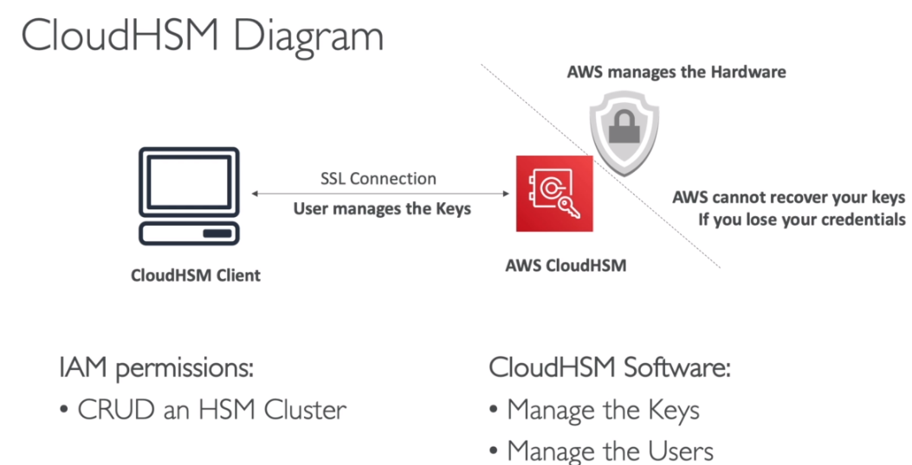

## Shield - DDoS Protection

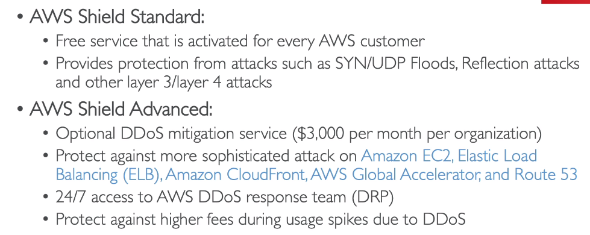

## Web Application Firewall (WAF)

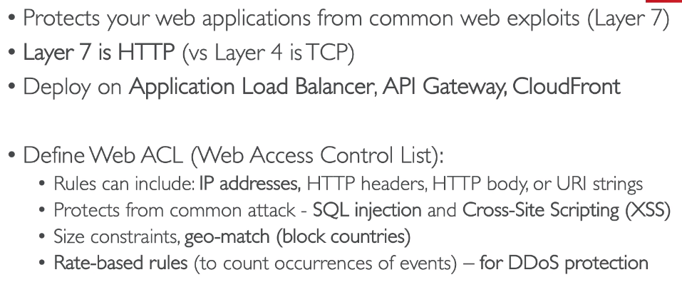

### Firewall Manager

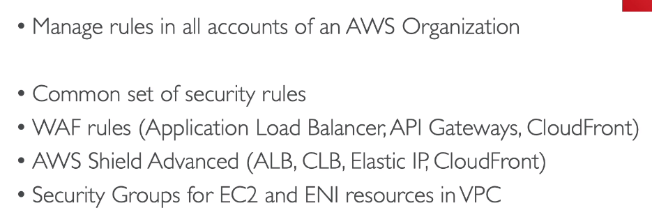

### Sample Reference Architecture for DDoS Protection

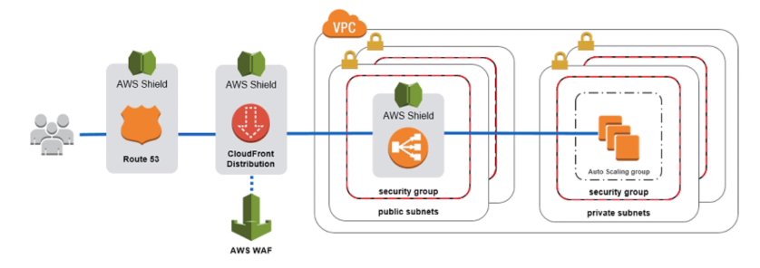

## Shared Responsibility Model

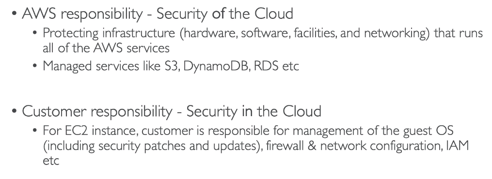

### Example RDS

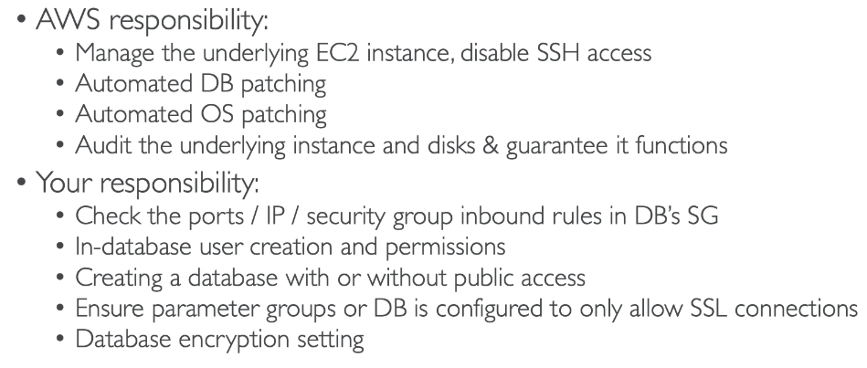

### Example S3

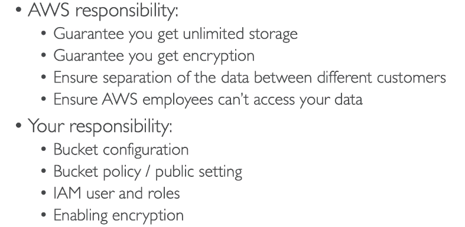

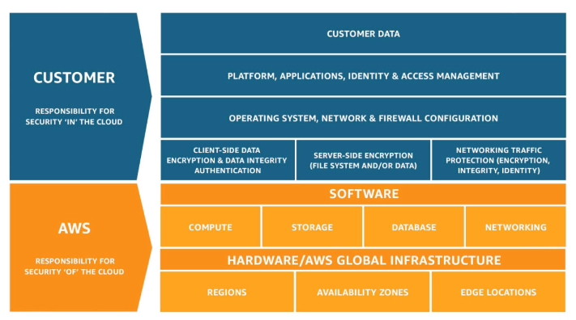

