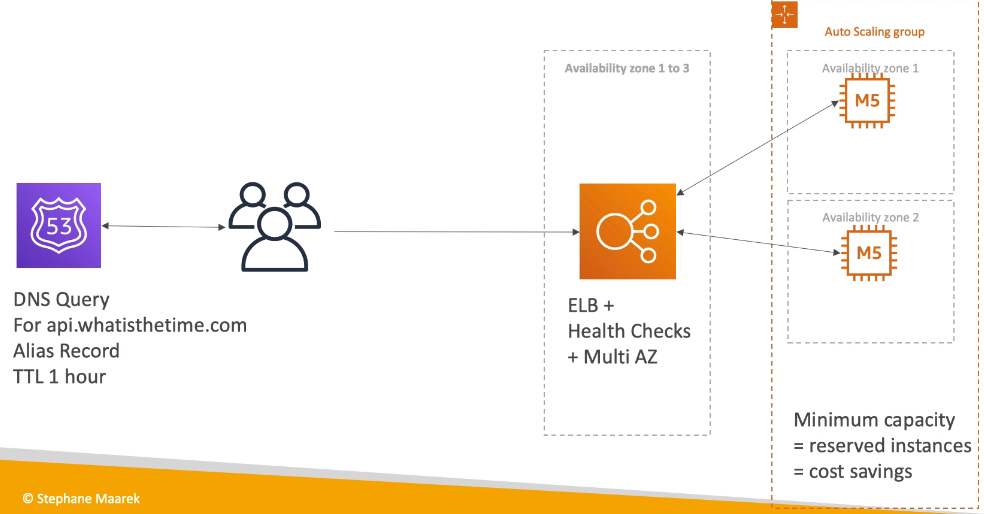

# Classic Solutions Architecture Discussions

## WhatsTheTime

### Starting simple

### Scaling vertically

### Scaling horizontally

### Scaling horizontally,with a load balancer

### Scaling horizontally,with an auto-scaling group

### Making our app multi-AZ

### Minimum 2 AZ => Let's reserve capacity

### Summary

## MyClothes

### Stateful Web App

### Introduce Stickiness(Session Affinity) 

###  Introduce User Cookies

### Introduce Server Session

### Storing User Data in a database

### Scaling Reads

### Scaling Reads(Alternative) - Write Through

**need some changes in application code**

## Multi AZ - Survive disasters

### SG

### Summary

## MyWordPress

### RDS layer

### Scaling with Aurora: Multi-AZ & Read Replicas

### Storing Images with EBS

when scaling,problem with multi-AZ of EBS

### Storing Images with EFS

### Summary

## Five pillars:

- Cost

- Performance
- Reliability
- Security
- Operational excellence

## Instantiating Application quickly

- EC2 instances
  - Use a **Golden AMI**: install your applications,OS dependencies etc. beforehand and launch your EC2 instance from the Golden AMI
  - Bootstrap using User Data: for dynamic configuration,user data scripts
  - Hybrid: mix Golden AMI and User Data (Elastic Beanstalk)
- RDS Databases
  - Restore from a snapshot: the database will have schemas and data ready
- EBS volumes:
  - Restore from a snapshot: the disk will already be formatted and have data

## BeanStalk 

### Typical architecture Web App 3-tier

### ElasticBeanStalk Overview

ElasticBeanstalk is a developer centric view of deploying an application on AWS

- Managed service
  - Instance configuration / OS is handled by Beanstalk
  - Deployment strategy is configurable but performed by Beanstalk
  - Just the application code is the responsibility of the developer
- Three architecture models:
  - Single Instance deployment: good for dev
  - LB + ASG: good for production or pre-production web applications
  - ASG only: good for non-web apps in production (workers,etc.)
- Three components:
  - Application
  - Application version: each deployment gets assigned a version
  - Environment name: free naming (DEV,TEST,PROD)
- You deploy application versions to environments and can promote application versions to the next environment
- Rollback feature to previous application version
- Full control over lifecycle of environments
- 

