# Disaster Recovery & Migrations

## Disaster Recovery

### Overview

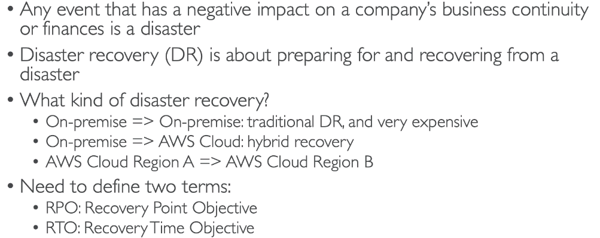

### RPO and RTO

**RPO**: how much data you are willing to lose when disaster happens

**RTO**: the time you recovery from the disaster

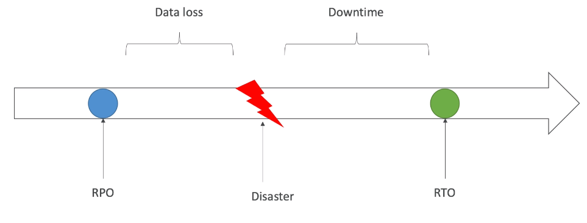

### Disaster Recovery Strategies

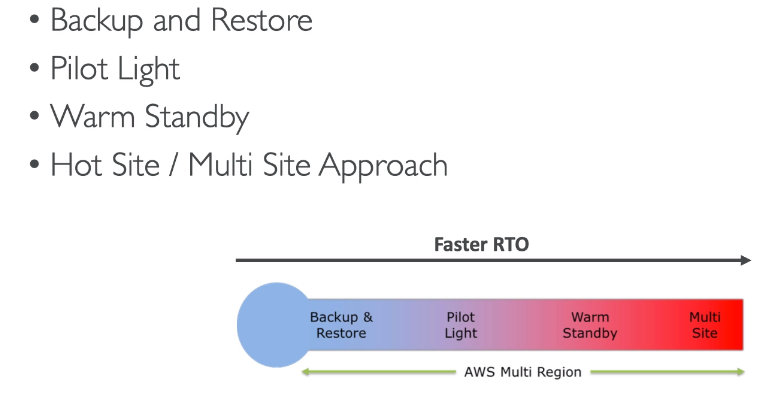

### Backup and Restore (High RPO)

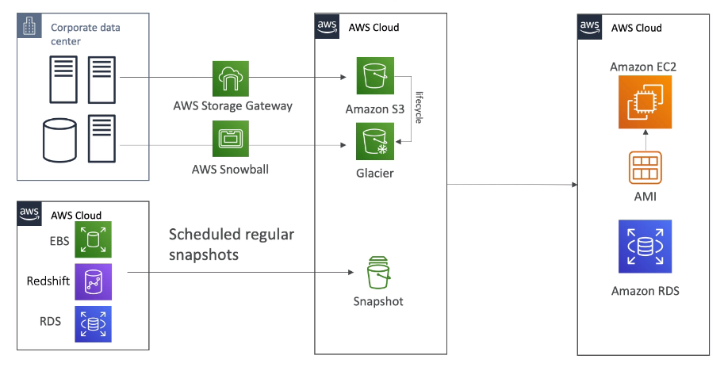

Very cheap,high RPO

### Pilot Light

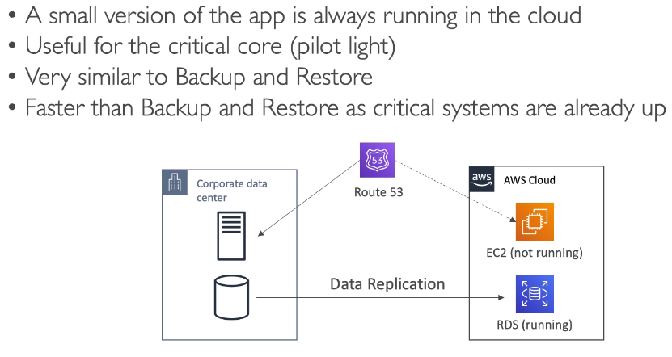

low RPO and RTO,cheap

### Warm Standby

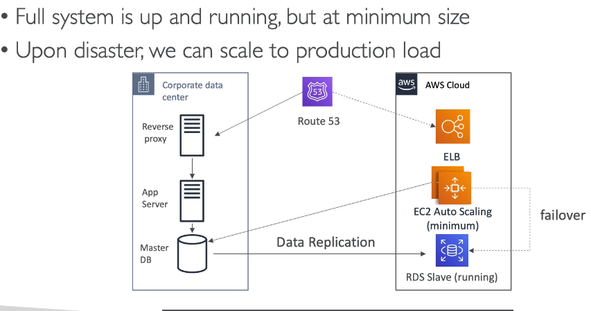

more expensive

### Multi Site / Host Site Approach

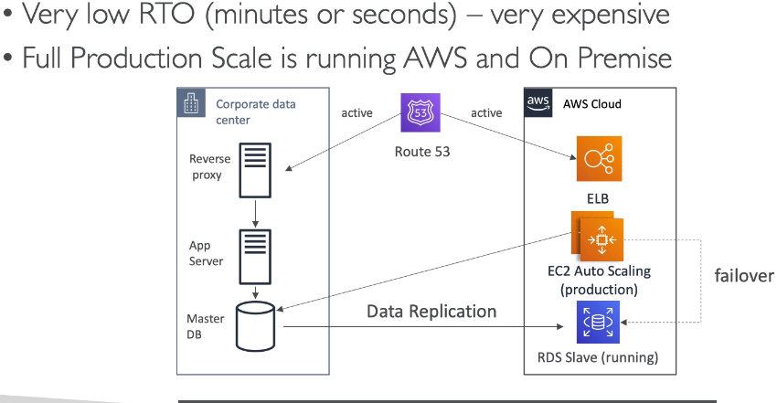

### All AWS Multi Region

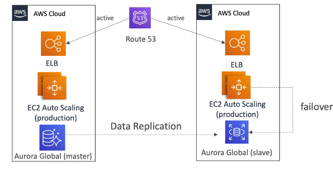

### Disaster Recovery Tips

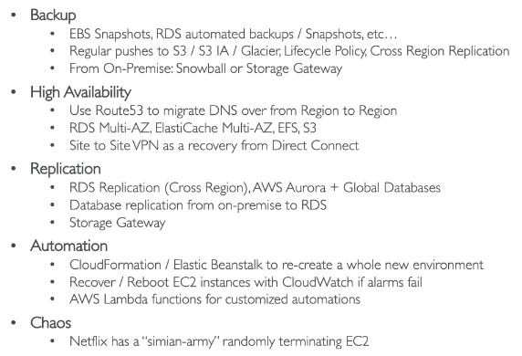

## Database Migration Service

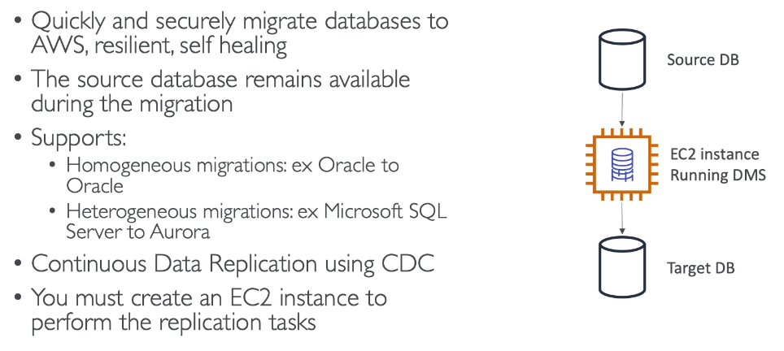

### DMS Sources and Targets

- Sources

  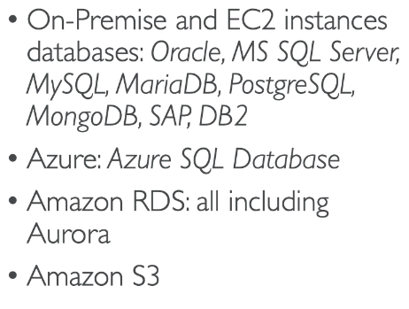

- Targets

  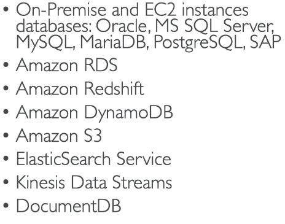

### AWS Schema Conversion Tool (SCT)

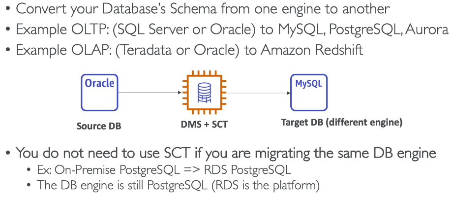

## On-premise Strategy with AWS

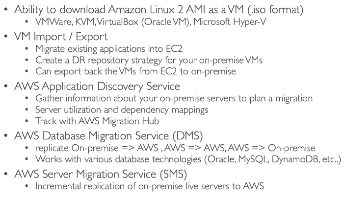

## DataSync 

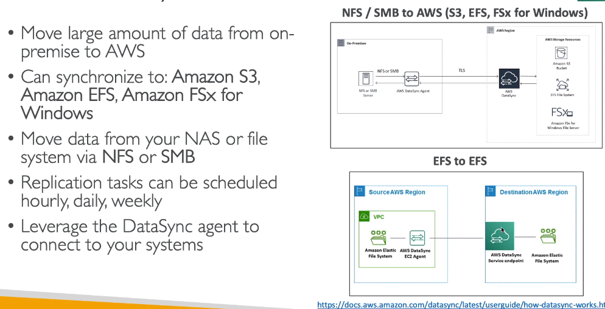

## Transferring Large Datasets into AWS

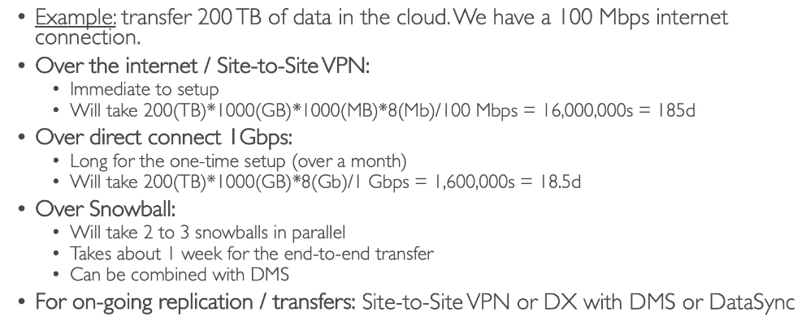

