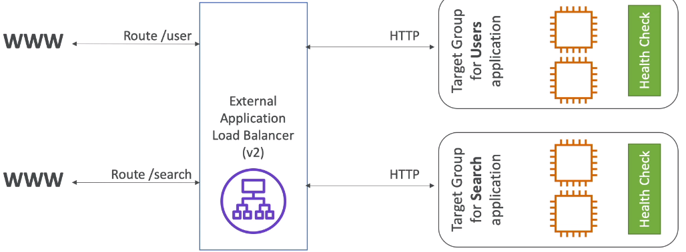
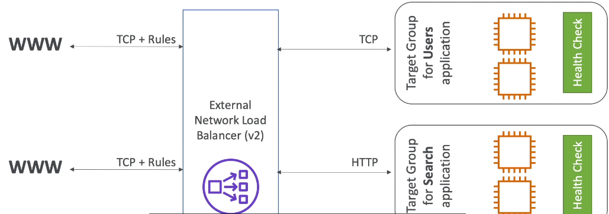
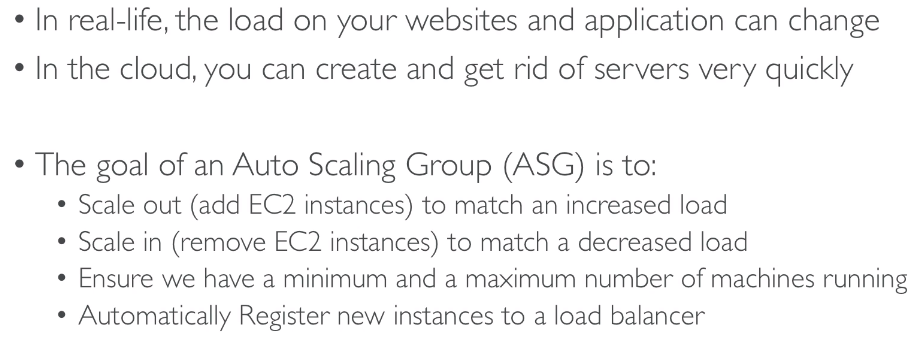

# ELB & ASG

## High Availability and Scalability 

### Vertical Scalability

### Horizontal Scalability

### High Availability

## ELB

### What is load balancing

### Why use a load balancer

### Why use an EC2 ELB

### Health Checks

### Types of load balancer on AWS

### Good to know

## Classic Load Balancer

## Application Load Balancer

 

### Target Groups

### Good to know

## Network Load Balancer

## Stickiness

## Cross Zone Load Balancing

## SSL Certificates

### Basics

### SNI

## Connection Draining

## ASG - Overview

### What is ASG

### ASG attributes

### Auto Scaling Alarm

### Brain Dump

## ASG - Scaling Policy

### Cool downs

## ASG - for Solutions Architects

### Default Termination Policy 

### Lifecycle Hooks

### Launch Template Vs Launch Configuration

