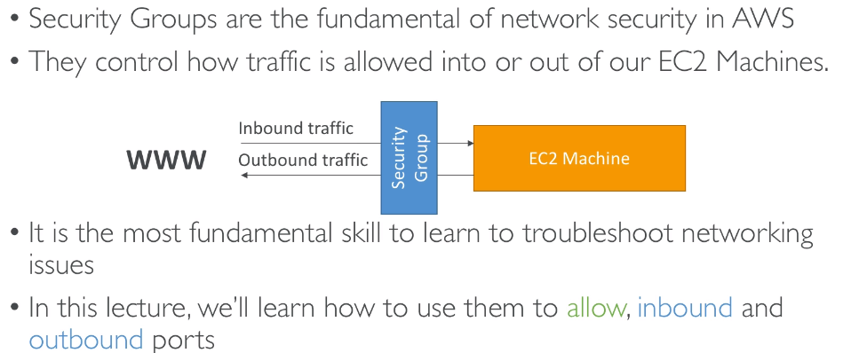
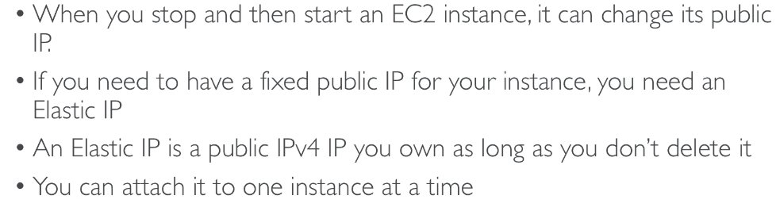

# IAM & EC2

## IAM Introduction

### AWS Regions

## IAM Introduction

## EC2 Introduction

## Security Group

### Deep Dive

**Referencing other security group**

## Private Vs Public Vs Elastic IP

### Private Vs Public

### Elastic IP

### EC2 User Data

## EC2 Launch Type

 

###  On-demand

****

### Reserved 

### Convertible Reserved 

### Scheduled Reserved Instances

### Spot 

### EC2 Dedicated Hosts

### EC2 Dedicated Instances

### Which host is right for me?

### Main Types

#### Burstable instance

#### T2/T3 Unlimited

## EC2 Spot Instances and Spot Fleet

### EC2 Spot Instance Requests

### How to terminate Spot Instances

### Spot Fleet

## AMI

### What's AMI

### Why would you use a custom AMI

### Using Public AMIs

### AMI Storage

### Pricing

 

### Cross Account AMI Copy (FAQ + Exam Tip)

## Placement Groups

### Cluster

### Spread

### Partition

## Elastic Network Interfaces (ENI) 

## EC2 Hibernate

## EC2 for Solutions Architects

