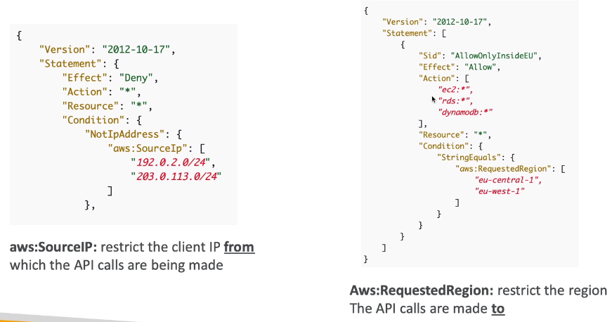

# IAM Advanced

##  Security Token Service (STS)

 ### Using STS to Assume a Role

### Cross account access with STS

## Identity Federation & Cognito

### SAML 2.0 Federation

### SAML 2.0 Federation - Active Directory FS

### Custom Identity Broker Application

### Web Identity Federation - AssumeRoleWithWebIdentity

### AWS Cognito

## Directory Services

### Microsoft Active Directory (AD)

### AWS Directory Services

## AWS Organizations

### Organizational Units (OU) - examples

### Service Control Policies (SCP)

### Moving Accounts

## IAM Advanced

### IAM Conditions

### IAM for S3

### IAM Roles Vs Resource based policies

## IAM - Policy Evaluation Logic

IAM Permission Boundary => only allow actions on S3,CloudWatch and EC2

IAM Permissions Through IAM Policy => create user => out of Permission Boundary => No Permissions

Example:

No,since there is explicit deny on SQS:*

No, since there is explicit deny on SQS:*

**Whenever we have a explicit deny,the answer should be deny**

No,since there is no explicit deny and allow and everything in AWS remains deny at beginning,so it deny

## Resource Access Manager (RAM)

### VPC Example

Account 1 cannot view,modify or delete EC2 of account2,vice versa

But all applications in this private subnet can access each other

## Single Sign-On (SSO)

### Setup with AD

### SSO Vs AssumeRoleWithSAML

