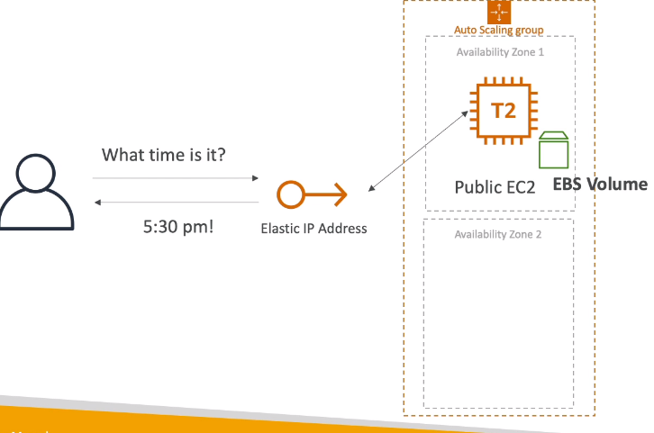
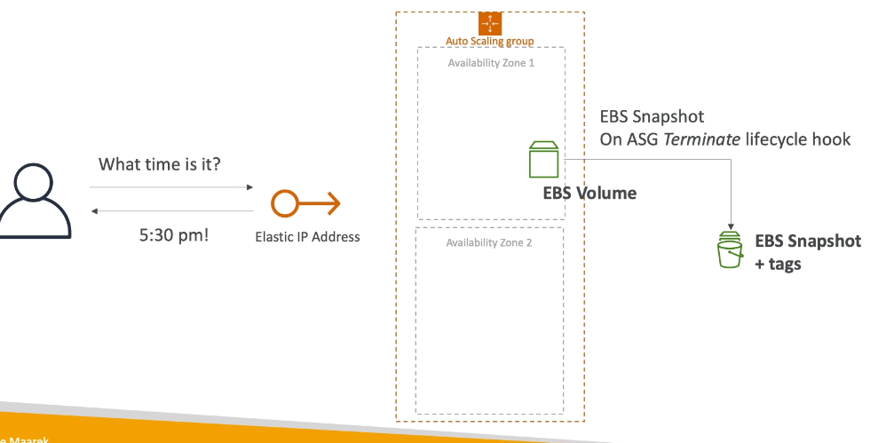
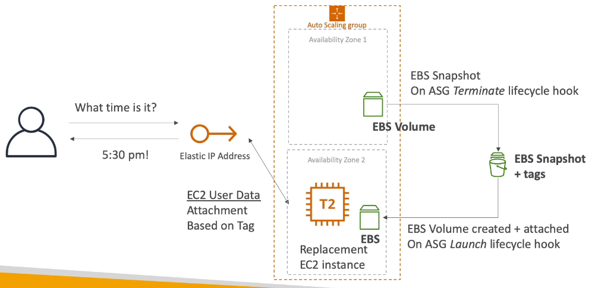
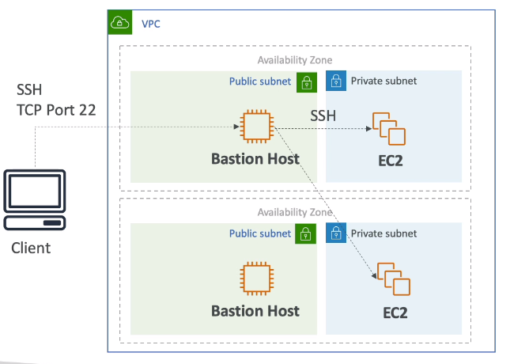
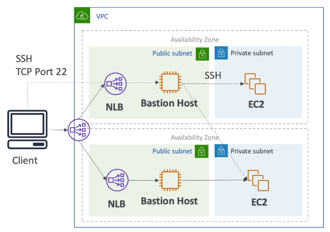

# More Solution Architectures

## Event Processing 

### Lambda, SNS and SQS

DLQ in SQS side																				DLQ in Lambda side

### Fan out pattern: deliver to multiple SQS

### S3 Event

## Caching Strategies in AWS

CloudFront: TTL to balance cache

API Gateway: regional service => cache will be regional

No caching in S3

## Blocking an IP Address in AWS

### Blocking an IP address

NACL: VPC level

### Blocking an IP address - with an ALB

Connection from Client will be terminated and ALB creates a new connection to EC2 instance

EC2 SG must be configured to connect to ALB SG 

### Blocking an IP address - with a NLB

NACL will work for particular clients' IPs

### Blocking an IP address - ALB + WAF

WAF: install to ALB

### Blocking an IP address - ALB,CloudFront WAF

CloudFront: geo-restriction feature to restrict all the country from out clients to be denied on CloudFront

ALB will need to receive public IP of CloudFront so NACL is not helpful at all (clients' IPs will go to CloudFront first)

## High Performance Computing (HPC)

### Data Management & Transfer

### Compute and Networking

### Storage

### Automation and Orchestration

## EC2 Instance High Availability

Lambda: detach Elastic IP from failed EC2 instance and attach to standby EC2 instance

### ASG Approach

### ASG + EBS

## Bastion Host High Availability

**We use NLB for TCP traffic**

**No ALB since it is for HTTP**

