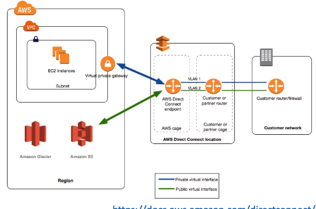
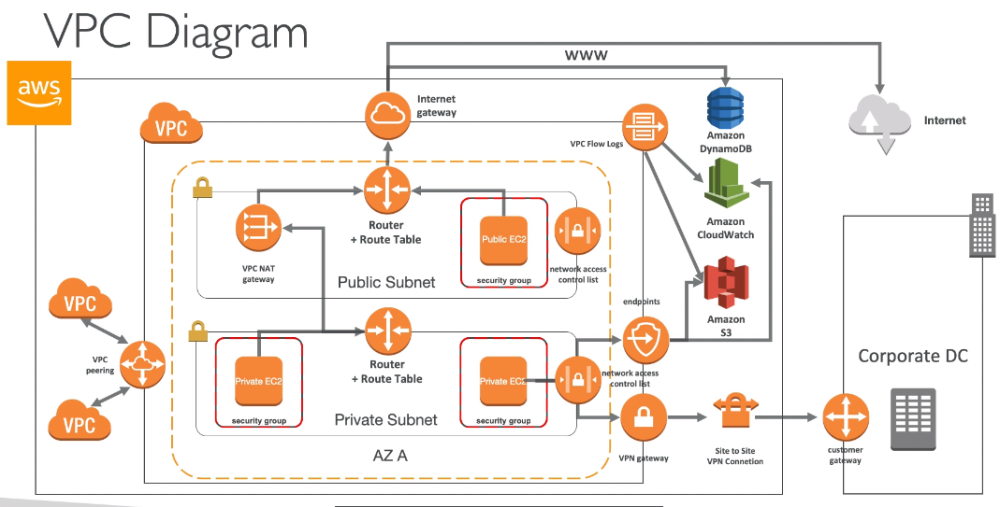

# Network - VPC

## CIDR, Private Vs Public IP

### Understanding CIDR - IPv4

#### Subnet Mask

### Private Vs Public IP (IPv4)

#### Allowed ranges

## Default VPC

## VPC - Overview

### Adding Subnets

## Internet Gateway & Route Tables

### Internet Gateway

### Adding IGW

### Editing Route Tables

## NAT Instance

### Comments

## NAT Gateways

### NAT Gateway with High Availability 

### NAT Gateway Vs Instance

## DNS Resolution Options & Route 53 Private Zones

## NACL & Security Group

### Incoming Request

If the inbound rules pass,the outbound will also pass automatically(stateful). But NACL outbound rules will evaluate again

### Outgoing Request

 

### Network ACLs

### Network ACLs Vs Security Group

**Ephemeral port**

## VPC Peering

## VPC Endpoints

**try to specify the region when you use endpoint** e.g. when `ls` S3 bucket,use 

`aws s3 ls --region eu-west-1`

## VPC Flow Logs

### Flow Logs Syntax

**Use Athena to do analysis on Flow logs**

## Bastion Hosts

## Site to Site VPN, Virtual Private Gateway & Customer Gateway

### Site to Site VPN

## Direct Connect & Direct Connect Gateway

### Direct Connect Gateway

**VPCs are not connected,not peered**

#### Connections Types

#### Encryption

## Egress only Internet Gateway

Egress = outgoing

## AWS PrivateLink - VPC Endpoint Services

### Exposing services in your VPC to other VPC

### AWS Private Link (VPC Endpoint Services)

## AWS ClassicLink

## VPN CloudHub

## Transit Gateway

Network topologies can become complicated

## VPC Section Summary

### Summary(1/3)

### Summary(2/3)

### Summary(3/3)

## Networking Costs in AWS

