## Question 1

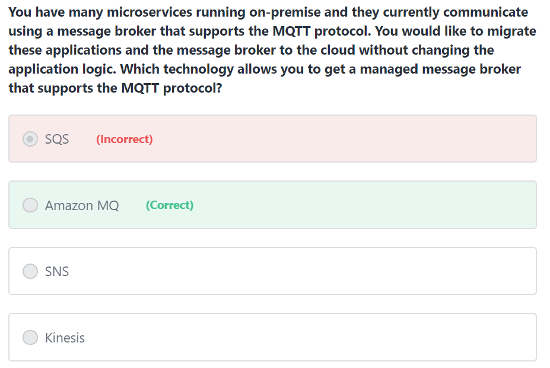

### Reason

**if you see we are migrating an app from on-premise with cloud, and the app is using the MQTT or the AMQP protocol or whatever,what should we use? Well, the answer is Amazon MQ.**

### From

Decoupling applications: SQS,SNS,Kinesis,Active MQ

chapter: Amazon MQ

## Question 2

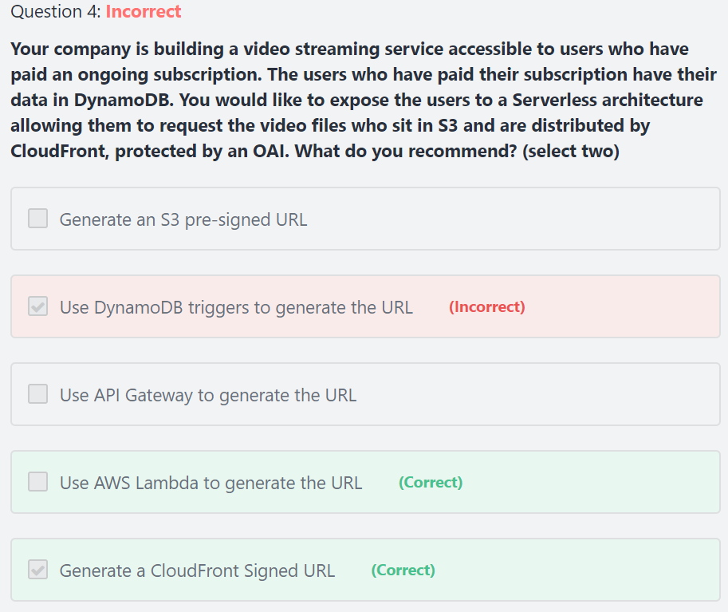

### Reason

Generating S3 pre-signed URLs would bypass CloudFront, therefore we should use CloudFront signed URL. To generate that URL we must code, and Lambda is the perfect tool for running that code on the fly. DynamoDB triggers or API Gateway as services cannot be used to generate these pre-signed URLs.

### From

CloudFront & AWS Global Accelerator

Chapter: CloudFront Signed URL/Cookies

## Question 3

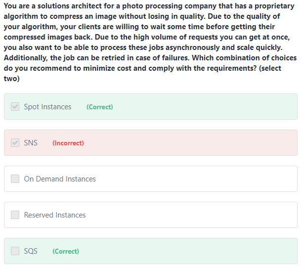

### Reason

SQS have build-in mechanism for retries and scales seamlessly

SNS can send message to multiple receivers

### From

Decoupling applications: SQS,SNS,Kinesis,Active MQ

Chapter: SQS,SNS

## Question 4

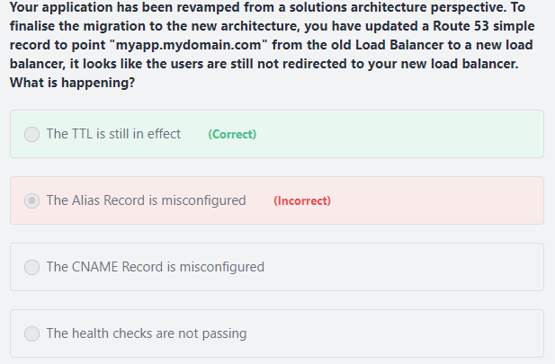

### Reason

First of all, simple routing does not have health checks. Then,the domain name works for CNAME and Alias since it's not a root domain. We cannot choose two and the most likely issue is that the TTL is still in effect

### From

Route53

## Question 5

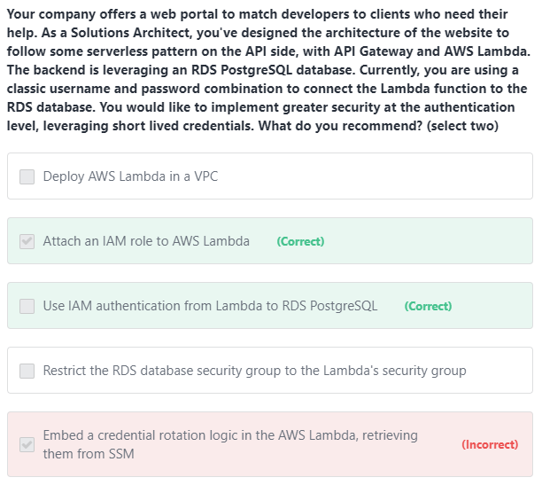

### Reason

We need to focus on "**implement greater security at the authentication level**",so deploying a Lambda in a VPC or tightening security groups does not change the authentication layer. But retrieving credentials from SSM is overkill

## Question 6

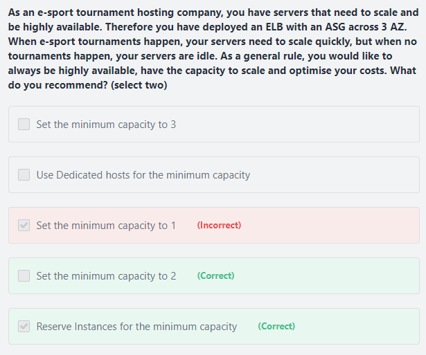

### Reason

Need to be highly available with an ASG across 3 AZ,we need at least two EC2

## Question 7

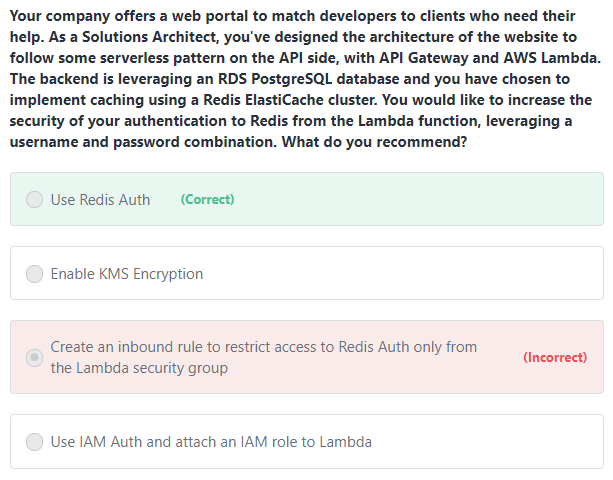

### Reason

IAM auth is not supported by ElastiCache, so last option is not correct. And Redis Auth is "You can set a "password/token" when you create a Redis cluster"

IAM policies on ElastiCache are only used for AWS API-level security such as creating/deleting a cluster and update configuration

### From

RDS Aurora ElastiCache

Chapter: Cache security

## Question 8

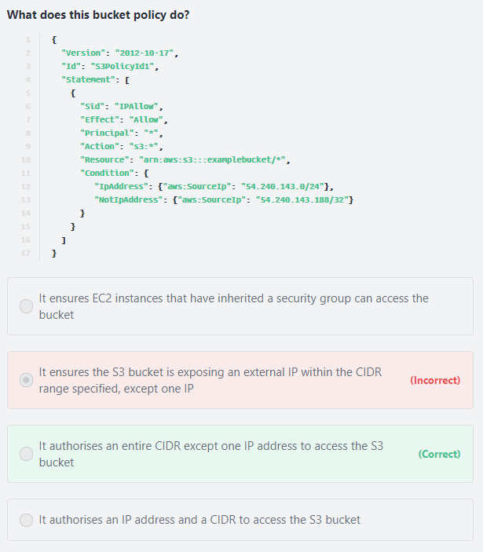

### Reason

It is a explicit "allow" and  accept source IP must be in the CIDR "54.240.143.0/24" (== 54.240.143.0 - 54.240.143.255),but not be in the CIDR "54.240.143.188/32" (== 1 IP, 54.240.143.188/32)

## Question 9

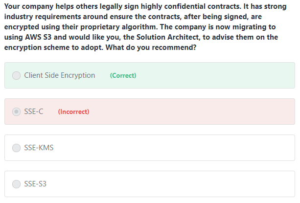

### Reason

Here, because the company has its own proprietary encryption algorithm, you have to leverage client side encryption

**Client Side Encryption Vs SSE-C:**

Client Side Encryption: Client side encryption and AWS does not manage it at all; HTTP/S

SSE-C: Server side encryption and clients provide date key to AWS. AWS will encrypt the data but never store the data key;HTTP only

### From

S3

Chapter: Encryption

## Question 10

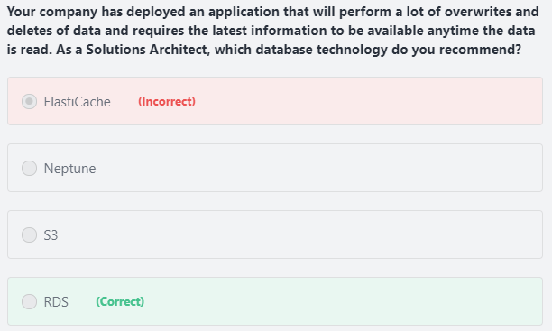

### Reason

we don't choose ElastiCache since it's a better fit as a caching technology to enhance **reads**

## Question 11

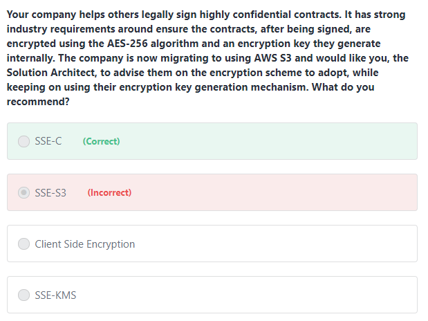

### Reason

We need to keep on using existing encryption key generation mechanism,which means the encryption will be provided to AWS and AWS will encrypt it. So,we choose SSE-C

### From

S3

Chapter: Encryption

## Question 12

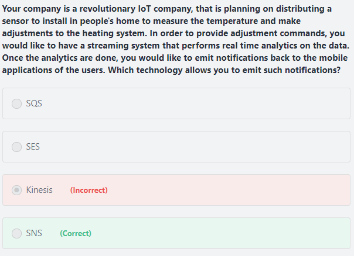

### Reason

The point is "emit notifications back to the mobile applications of the users" => SNS

 SQS and Kinesis do not have the feature of sending notifications

SES => email sending service

### From

Decoupling applications: SQS,SNS,Kinesis,Active MQ

Chapter: SQS Vs SNS Vs Kinesis

## Question 13

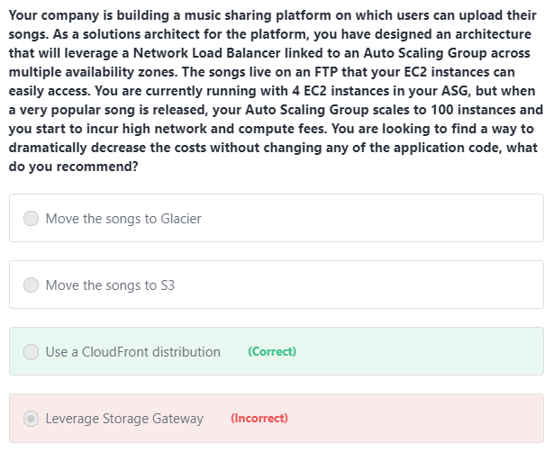

### Reason

S3 will change the application code and Glacier cannot support frequent requests

Storage Gateway is not for distributed files to end users

## Question 14

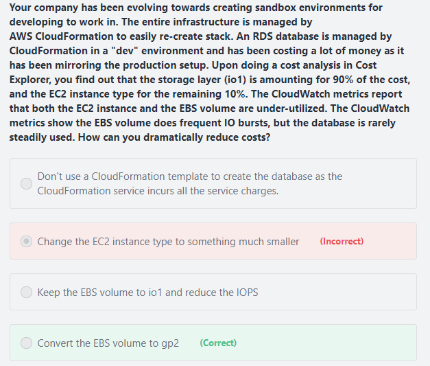

### Reason

We cannot reduce the IOPS and CloudFormation is free service

EC2 only takes 10% of cost so it won't be a significate decrease with change type of EC2

gp2 EFS can save the cost while keeping a burst in performance when needed

## Question 15

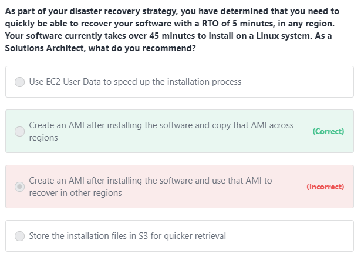

### Reason

EC2 User Data will run the same installation script and not reduce the time

S3 needs to happen on the EC2

We just need to copy the AMI to cross region

**copy AMI cross region Vs copy shared AMI**:

copy AMI cross region is available service for AMI,we just use it directly within the ownership of the AMI

copy shared AMI: launch an EC2 instance based on the shared AMI and create a AMI from that EC2 

### From

IAM & EC2

Chapter: AMI

## Question 16

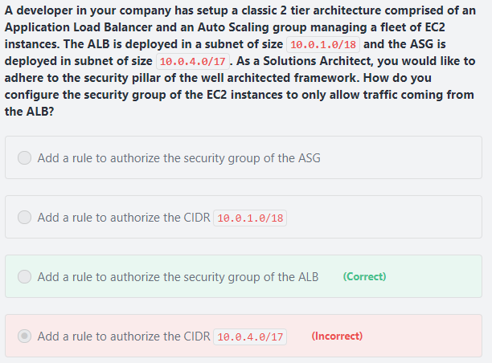

### Reason

Adding the entire CIDR of the ALB would work, but wouldn't guarantee that only the ALB can access the EC2 instances that are part of the ASG. Here, the right solution is to add a rule on the ASG security group to allow incoming traffic from the security group configured for the ALB.

### From

ELB & ASG

## Question 17

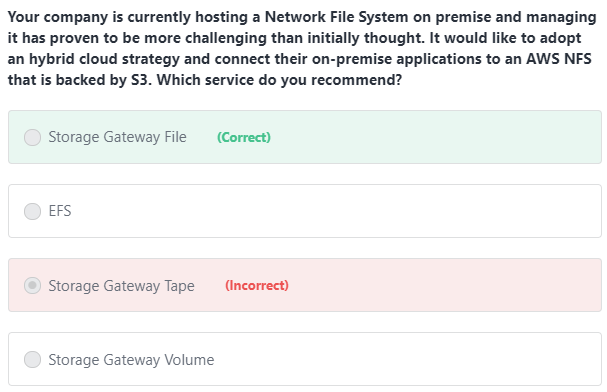

### Reason

Storage Gateway:

File: 

- **NFS/EFS** protocol access to S3
- can cache most recent data,
- can be mounted to many servers,
- bucket access using IAM roles for each File Gateway

Volume:

- **iSCSI** protocol access to S3,
- backed by EBS which can help restore on-premise volumes,
- low latency access to most recent data
- Stored volume: entire dataset is on-premise,scheduled backups to S3

Tape:

- Some companies have backup processes using physical tapes
- With Tape Gateway,companies use the same processes but in the cloud
- **Virtual Tape Library (VTL)** backed by S3 and Glacier
- Back up data using existing tape-based processes (and iSCSI interface)
- Works with leading backup software vendors

### From

AWS Storage Extras

Chapter: Storage Gateway

## Question 18

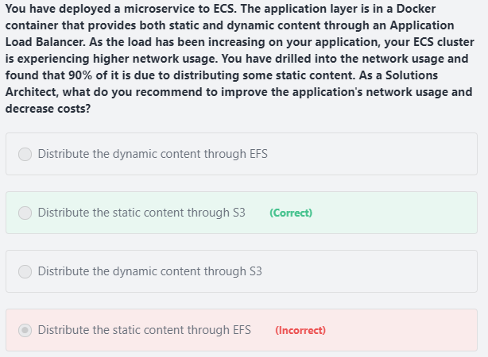

### Reason

Distributing the static content through S3 allows to offload most of the network usage to S3 and free up our applications running on ECS. EFS will not change anything as static content on EFS would still have to be distributed by our ECS instances

## Question 19

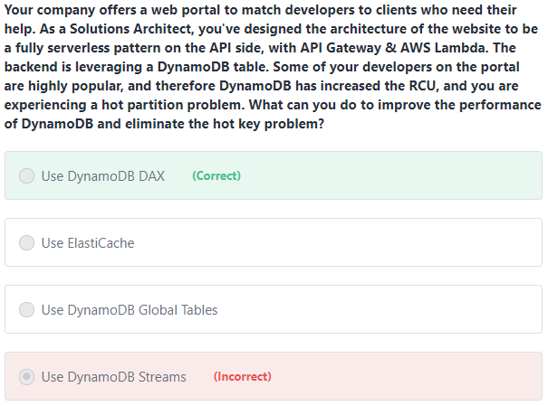

### Reason

DynamoDB DAX (DynamoDB Accelerator):

-  is seamless cache for DynamoDB,and no application re-write. 
- It can be used to resolve hot key problem( too many read)

DynamoDB Streams:

- changes in DynamoDB(create,update,delete) can end up in DynamoDB Streams
- This stream can be read by AWS Lambda ,such that we could do 
  - React in real time(welcome email to new users)
  - Analytics
  - Create derivative tables/views
  - Insert into ElasticSearch
- cross region replication
- Stream has 24 hours of data retention

DynamoDB Global Tables:

- cross region replication
- active active replication,many regions
- must enable DynamoDB Streams
- Useful for low latency,DR purposes

ElasticCache would fix this problem but we need to refactor (re-write) application

### From

Serverless Overview

Chapter: DynamoDB

## Question 20

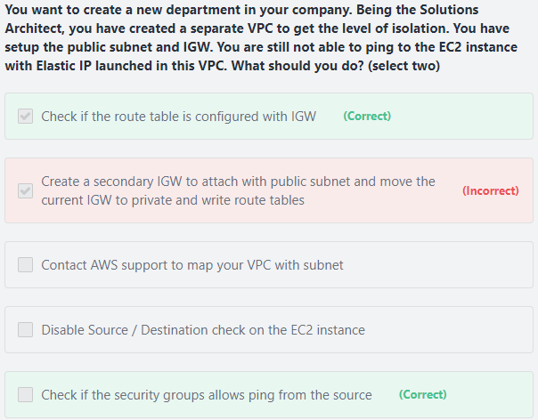

### Reason

After creating an IGW, make sure the route tables are updated. We don't need a secondary IGW since it's a public subnet instance and for instance in private subnet may need NAT Gateway. So what we should check additionally is to ensure that SG of instance allows the ping requests

### From

Network

Chapter: Internet Gateway & Route Tables

## Question 21

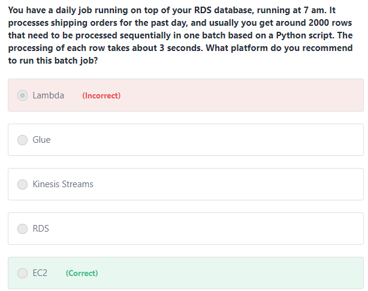

### Reason

Lambda will have max 15 mins time-out so it's not good for this task.

Glue is for ETL task and **cannot** run custom Python script

Kinesis Streams is for real time data

RDS cannot run Python scripts but SQL queries

### From

Serverless Overview

Chapter: Lambda

Decoupling applications: SQS,SNS,Kinesis,Active MQ

Chapter: Kinesis Streams

## Question 22

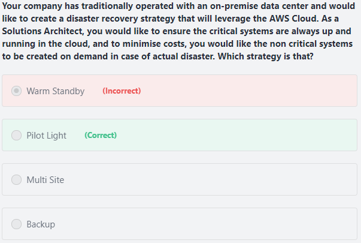

### Reason

## Question 23

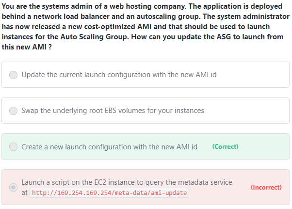

### Reason

Launch configurations are immutable meaning they cannot be updated. You have to create a new launch configuration, attach it to the ASG and then terminate old instances / launch new instances

### From

IAM & EC2

## Question 24

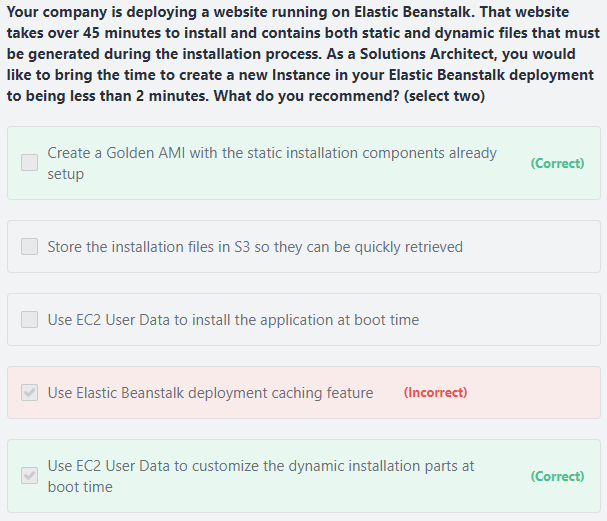

### Reason

In order to instantiate application quickly, use Golden AMI and User Data

Golden AMI: install your applications,OS dependencies

User Data: for dynamic configuration,user data scripts

## Question 25

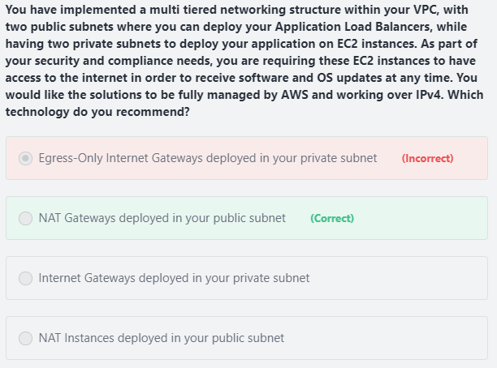

### Reason

NAT Instances would work but won't scale and you would have to manage them (as they're EC2 instances). Egress-Only Internet Gateways are for IPv6, not IPv4. Internet Gateways must be deployed in a public subnet. Therefore you must use a NAT Gateway in your public subnet in order to provide internet access to your instances in your private subnets.

### From

Network - VPC

## Question 26

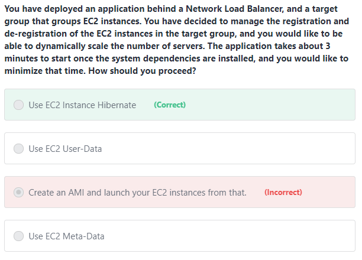

### Reason

Here, the problem is that the application takes 3 minutes to launch, no matter what. EC2 user data won't help us because it's just here to help us execute a list of commands, not speed them up.

The EC2 meta-data is a distractor and can only help us determine some metadata attributes on our EC2 instances.

Creating an AMI may help with all the system dependencies, but it won't help us with speeding up the application start time.

By pre-launching an instance, starting the application, and then using EC2 hibernate, we have the capability to resume it at any point of time, with the application already launched, thus helping us cut the 3 minutes start time.

### From

IAM & EC2

Chapter:EC2 Hibernate

## Question 27

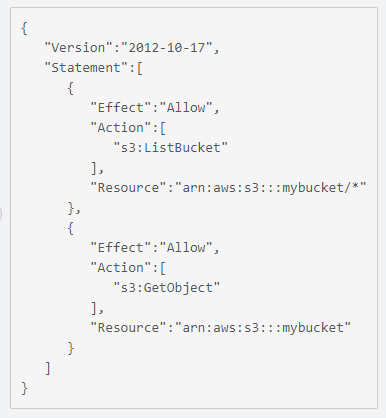

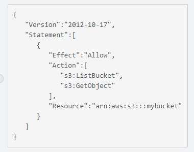

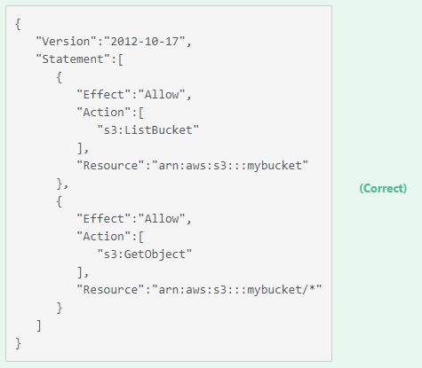

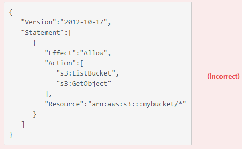

### Reason

`s3:ListBucket` is applied to buckets, so the ARN is in the form `"Resource":"arn:aws:s3:::mybucket"`, without a trailing `/` `s3:GetObject` is applied to objects within the bucket, so the ARN is in the form `"Resource":"arn:aws:s3:::mybucket/*"`, with a trailing `/*` to indicate all objects within the bucket `mybucket`

## Question 28

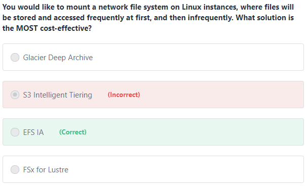

### Reason

Because we need to mount a network file system on our Linux instances, we need to rule out Glacier Deep Archive and S3 Intelligent Tiering.

FSx for Lustre is a file system better suited for distributed computing for HPC (high-performance computing) and is very expensive

Amazon EFS Infrequent Access (EFS IA) is a storage class that provides price/performance that is cost-optimized for files, not accessed every day, with storage prices up to 92% lower compared to Amazon EFS Standard.

## Question 29

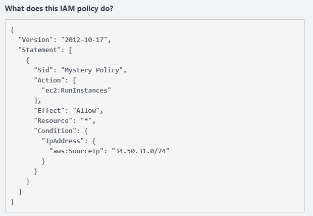

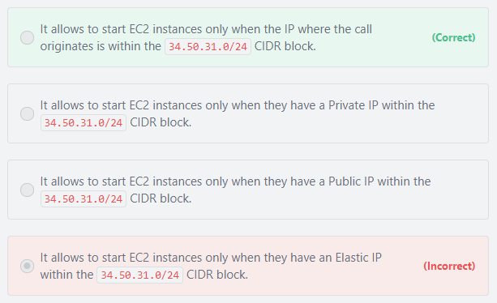

### Reason

The `aws:SourceIP` in this condition

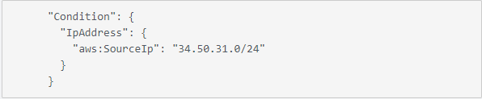

Always represents the IP of the caller of the API. That is very helpful if you want to restrict access to certain AWS API for example from the public IP of your on-premises infrastructure.

Please note `34.50.31.0/24` is a public IP range, not a private IP range. Private IP ranges are: 192.168.0.0 - 192.168.255.255 (65,536 IP addresses) 172.16.0.0 - 172.31.255.255 (1,048,576 IP addresses) 10.0.0.0 - 10.255.255.255 (16,777,216 IP addresses)

## Question 30

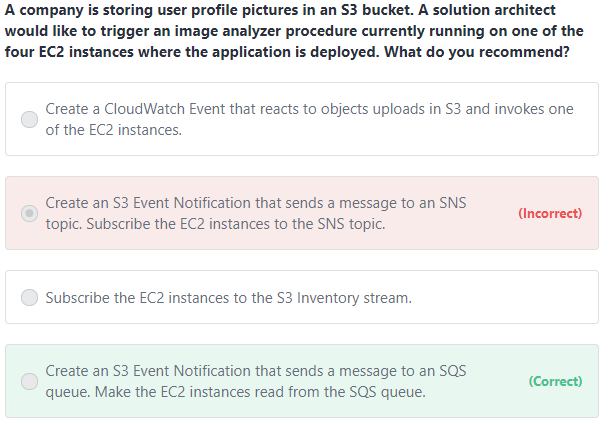

### Reason

S3 Inventory is a distractor. If you're curious: Amazon S3 inventory helps you manage your storage by creating lists of the objects in an S3 bucket on a defined schedule.

CloudWatch Events cannot invoke applications on EC2 instances, so we have to rule out that answer.

Here we have to use S3 Event Notifications (which can send a message to either Lambda, SNS or SQS)

Using SNS would send a message to each EC2 instance, therefore making **all of them** work for each upload. This is not the intended behavior.

By using SQS, we know only one EC2 instance among the four we have will pick up a message and process it.

## Question 31

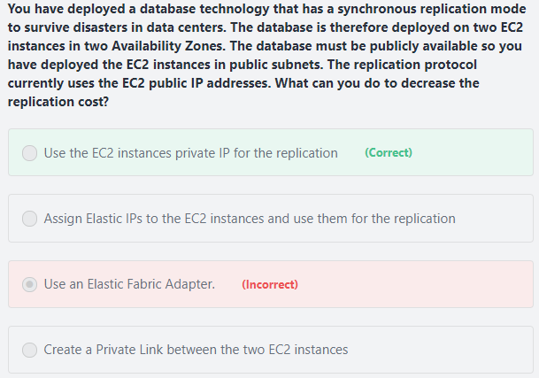

### Reason

The source of the cost is that traffic between two EC2 instances is going over the public internet, thus incurring high costs.

Using Elastic IPs will not solve the problem as the traffic will still be going over the public internet.

Private Link is a distractor in this question. Private Link is leveraged to create a private connection between an application that is fronted by an NLB in an account, and an Elastic Network Interface (ENI) in another account, without the need of VPC peering and allowing the connections between the two to remain within the AWS network.

The Elastic Fabric Adapter (EFA) is a network interface for Amazon EC2 instances that enables customers to run HPC applications requiring high levels of inter-instance communications, like computational fluid dynamics, weather modeling, and reservoir simulation, at scale on AWS.

Here, the correct answer is to use Private IP, so that the network remains private, for a minimal cost.

## Question 32

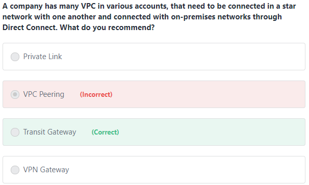

### Reason

VPC Peering helps connect two VPC and is not transitive. It would require to create many peering connections between all the VPC to have them connect. This alone wouldn't work, because we would need to also connect the on-premises data center through Direct Connect and Direct Connect Gateway, but that's not mentioned in this answer.

VPN Gateway is a distractor here because we haven't mentioned a VPN.

Private Link is utilized to create a private connection between an application that is fronted by an NLB in an account, and an Elastic Network Interface (ENI) in another account, without the need of VPC peering, and allowing the connections between the two to remain within the AWS network.

Here, this is a perfect use case for the Transit Gateway.

Without Transit Gateway

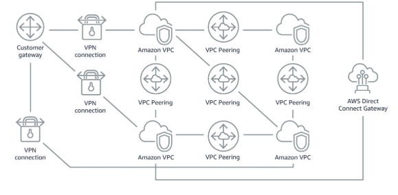

With Transit Gateway 

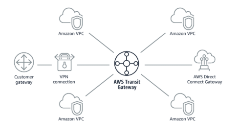

## Question 33

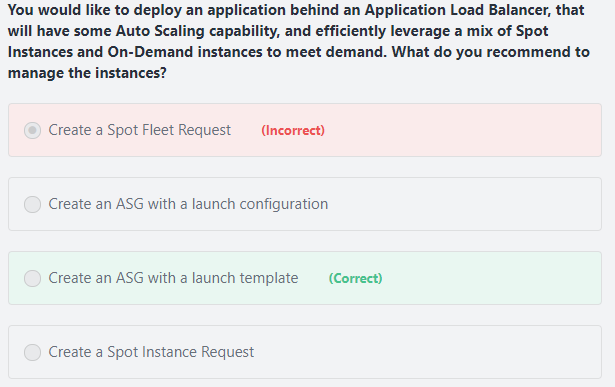

### Reason

Spot Instance Requests only help to launch spot instances so we have to rule that out.

Spot Fleet requests will help launch a mix of On-Demand and Spot, but won't have the auto-scaling capability we need.

ASG Launch Configurations do not support a mix of On-Demand and Spot.

Launch Templates do support a mix of On-Demand and Spot instances, and thanks to the ASG, we get auto-scaling capabilities.

## Question 34

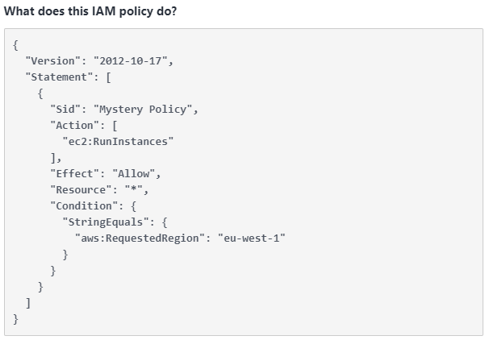

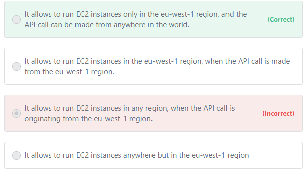

### Reason

`aws:RequestedRegion` presents the target of the API call. So in this example, we can only launch EC2 instances in eu-west-1, and we can do this API call from anywhere.

## Question 35

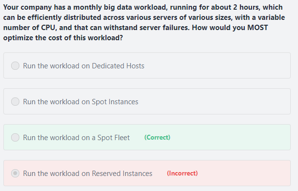

### Reason

Reserved Instances are less cost-optimized than Spot Instances, and most efficient when used continuously. Here the workload is once a month, so this is not efficient.

Amazon EC2 Dedicated Hosts allow you to use your eligible software licenses from vendors such as Microsoft and Oracle on Amazon EC2 so that you get the flexibility and cost-effectiveness of using your licenses, but with the resiliency, simplicity, and elasticity of AWS. An Amazon EC2 Dedicated Host is a physical server fully dedicated for your use, so you can help address corporate compliance requirement. They're not particularly cost-efficient.

Spot Instances provide great cost efficiency, but we need to select an instance type in advance. In this case, we want to optimize the cost as well as possible and leave the selection of the cheapest spot instance to a Spot Fleet request, which can be optimized with the `lowestPrice` strategy.

## Question 36

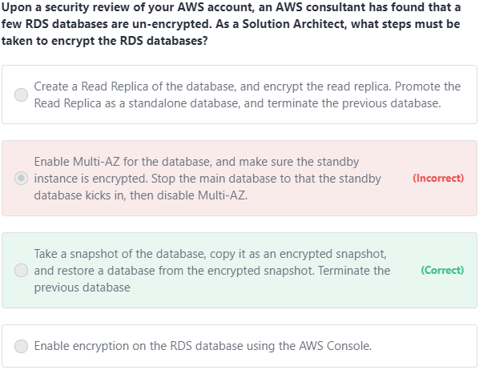

### Reason

If the master is not encrypted, the read replicas cannot be encrypted

Multi-AZ is to help with High Availability, not encryption.

And there is no direct option to encrypt an RDS database using the AWS Console directly.

**To encrypt an un-encrypted RDS database:** Create a snapshot of the un-encrypted database Copy the snapshot and enable encryption for the snapshot Restore the database from the encrypted snapshot Migrate applications to the new database, and delete the old database

## Question 37

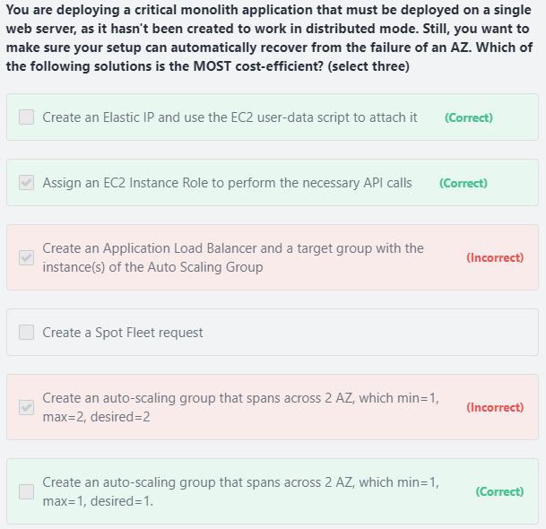

### Reason

Let's proceed by elimination.

Spot Fleets requests would not fit our purpose as we are looking at a *critical* application. Spot instances can be terminated.

An ASG with desired=2 would create two instances, and this won't work for us as our monolith application is not made to work with two instances as per the questions.

So we have an ASG with desired=1, across two AZ, so that if an instance goes down, it is automatically recreated in another AZ.

Now, between the ALB and the Elastic IP. If we use an ALB, things will still work, but we will have to pay for the provisioned ALB which sends traffic to only one EC2 instance. Instead, to minimize costs, we must use an Elastic IP.

For that Elastic IP to be attached to our EC2 instance, we must use an EC2 user data script, and our EC2 instance must have the correct IAM permissions to perform the API call, so we need an EC2 instance role.

## Question 38

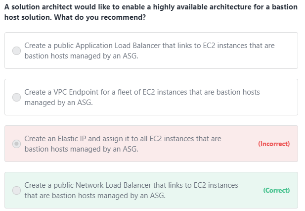

### Reason

You need to remember that Bastion Hosts are using the SSH protocol, which is a TCP based protocol on port 22. They must be publicly accessible.

An ALB only supports HTTP traffic, which is layer 7, while the SSH protocol is based on TCP and is layer 4. So, the Application Load Balancer doesn't work.

An Elastic IP can only be attached to one EC2 instance at a time, so it won't provide you a highly available setup on its own. Note that if we had two Elastic IPs and two Bastion Hosts, this would work.

VPC Endpoints are not used on top of EC2 instances. They're a way to access AWS services privately within your VPC (without using the public internet). This is a distractor.

Here, the correct answer is to use a Network Load Balancer, which supports TCP traffic, and will automatically allow you to connect to the EC2 instance in the backend.

## Question 39

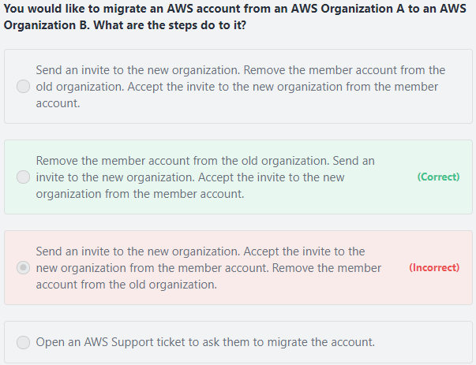

### Reason

To migrate accounts from one organization to another 1. Remove the member account from the old organization 2. Send an invite to the new organization 3. Accept the invite to the new organization from the member account

## Question 40

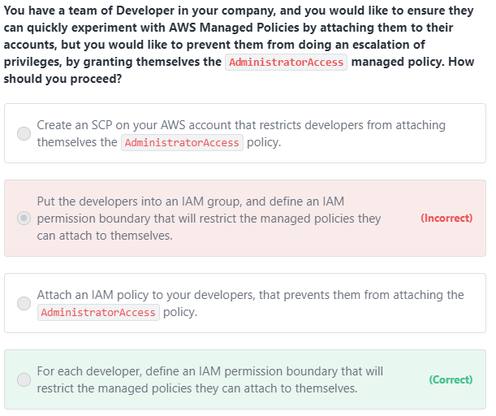

### Reason

Attach an IAM policy to your developers, that prevents them from attaching the `AdministratorAccess` policy. => this won't work as they can remove this policy from themselves and escalate their privileges.

Create an SCP on your AWS account that restricts developers from attaching themselves the `AdministratorAccess` policy. => AWS Organization is not mentioned in this question, so we can't apply an SCP.

Here we have to use an IAM permission boundary. They can only be applied to roles or users, not IAM groups.