# Practice two

## Question 1

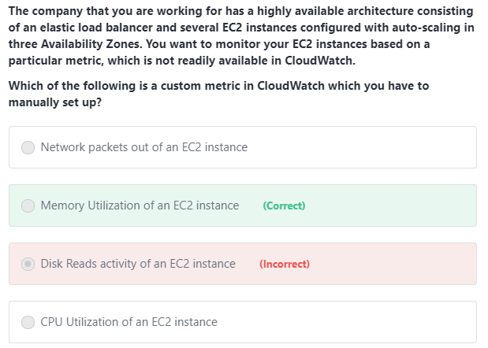

### Explanation 

**CPU Utilization of an EC2 instance**, **Disk Reads activity of an EC2 instance**, and **Network packets out of an EC2 instance** are all incorrect because these metrics are readily available in CloudWatch by default.

### From

AWS Monitoring & Audit: CloudWatch,CloudTrail & Config

Chapter:EC2 Detailed monitoring

## Question 2

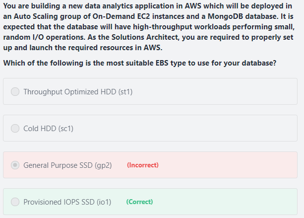

### Explanation

The table of difference between SSD and HDD

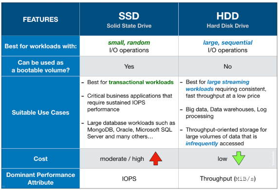

From the given info, HDDs will not suit this since there is small and random I/O

**General Purpose SSD (gp2)** is incorrect because although General Purpose is a type of SSD that can handle small, random I/O operations, the Provisioned IOPS SSD volumes are much more suitable to meet the needs of I/O-intensive database workloads such as MongoDB, Oracle, MySQL, and many others.

### From

EBS & EFS

Chapter: Type

## Question 3

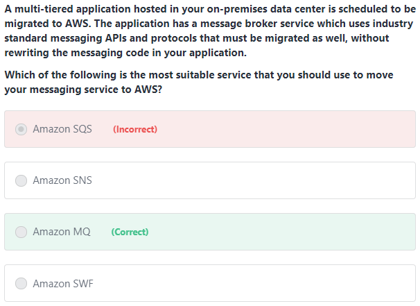

### Explanation

Since there is an existing messaging services, Amazon MQ is recommended.

Amazon MQ, Amazon SQS, and Amazon SNS are messaging services that are suitable for anyone from startups to enterprises. If you're using messaging with existing applications and want to move your messaging service to the cloud quickly and easily, it is recommended that you consider Amazon MQ. It supports industry-standard APIs and protocols so you can switch from any standards-based message broker to Amazon MQ without rewriting the messaging code in your applications.

## Question 4

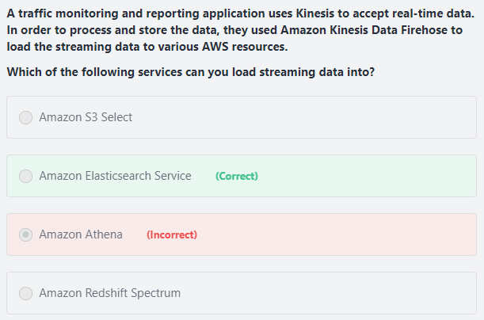

### Explanation

Kinesis Data firehose can load data to S3,Redshift,ElasticSearch and Splunk

S3 select and Redshift Spectrum are the some particular features so Kinesis Data firehose cannot directly load data to them

### From

Decoupling applications: SQS,SNS,Kinesis,Active MQ

Chapter: Kinesis Firehose

## Question 5

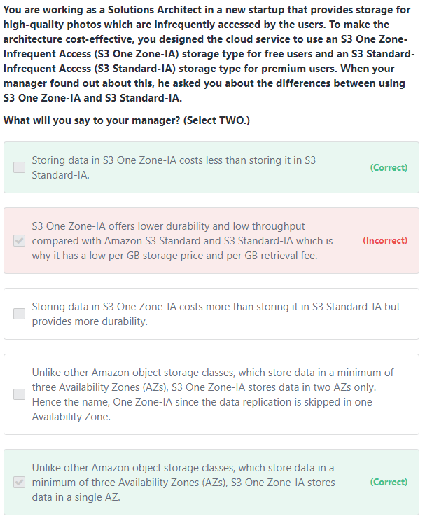

### Explanation

S3 One Zone-IA offers the same high durability, high throughput, and low latency of Amazon S3 Standard and S3 Standard-IA, with a low per GB storage price and per GB retrieval fee. 

- Same low latency and high throughput performance of S3 Standard and S3 Standard-IA
- Designed for durability of 99.999999999% of objects in a single Availability Zone, but data will be lost in the event of Availability Zone destruction
- Designed for 99.5% availability over a given year
- Backed with the Amazon S3 Service Level Agreement for availability
- Supports SSL for data in transit and encryption of data at rest
- Lifecycle management for automatic migration of objects
- Remember that since the S3 One Zone-IA stores data in a single AWS Availability Zone, data stored in this storage class will be lost in the event of Availability Zone destruction.

### From

S3 

Chapter: S3 Tire

## Question 6

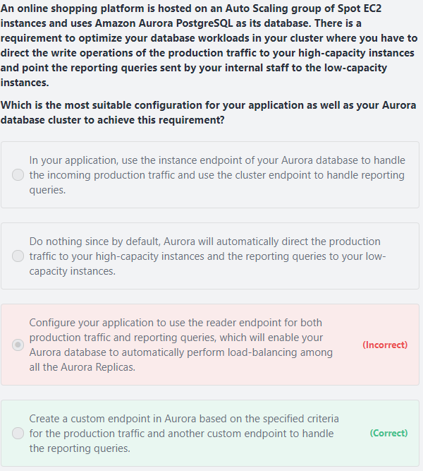

### Explanation

**The custom endpoint** provides load-balanced database connections based on criteria other than the read-only or read-write capability of the DB instances. For example, you might define a custom endpoint to connect to instances that use a particular AWS instance class or a particular DB parameter group. Then you might tell particular groups of users about this custom endpoint. For example, you might direct internal users to low-capacity instances for report generation or ad hoc (one-time) querying, and direct production traffic to high-capacity instances. Hence, **creating a custom endpoint in Aurora based on the specified criteria for the production traffic and another custom endpoint to handle the reporting queries** is the correct answer.

**Configuring your application to use the reader endpoint for both production traffic and reporting queries, which will enable your Aurora database to automatically perform load-balancing among all the Aurora Replicas** is incorrect because although it is true that a reader endpoint enables your Aurora database to automatically perform load-balancing among all the Aurora Replicas, it is quite limited to doing read operations only. You still need to use a custom endpoint to load-balance the database connections based on the specified criteria.

## Question 7

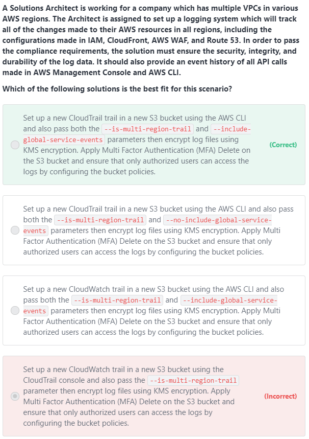

### Explanation

We want to monitor all changes in AWS resources,CloudTrail can be used for this case with multi-region trail enabled.

Also,**`--include-global-service-events`**is needed for global services such as IAM, Route 53, AWS WAF, and CloudFront

## Question 8

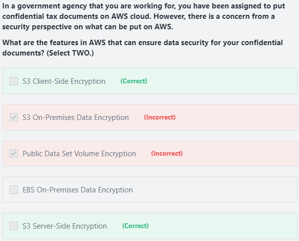

### Explanation

You can secure the privacy of your data in AWS, both at rest and in-transit, through encryption. If your data is stored in EBS Volumes, you can enable EBS Encryption and if it is stored on Amazon S3, you can enable **client-side** and **server-side encryption**.

**Public Data Set Volume Encryption** is incorrect as public data sets are designed to be publicly accessible.

**EBS On-Premises Data Encryption** and **S3 On-Premises Data Encryption** are both incorrect as there is no such thing as On-Premises Data Encryption for S3 and EBS as these services are in the AWS cloud and not on your on-premises network.

## Question 9

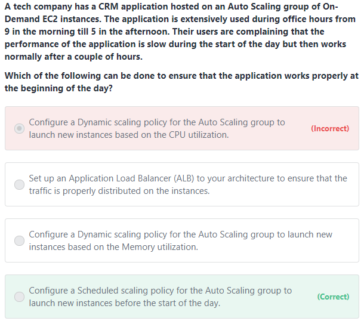

### Explanation

First of all,we need to modify scaling policy in order to increase or decrease instance number. Also we already know the peak time,the Scheduled scaling policy is the best choice

### From

ELB & ASG

Chapter: ASG - Scaling Policy

## Question 10

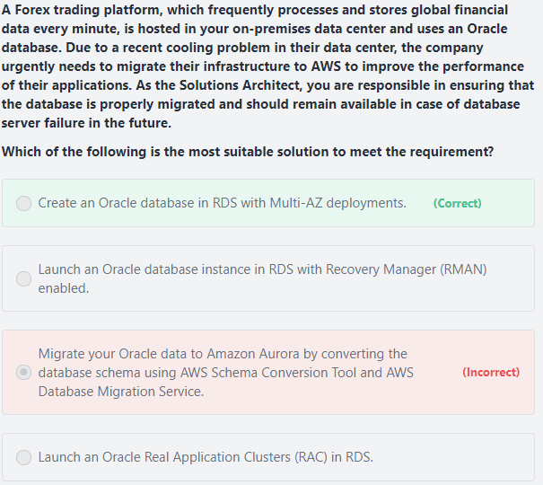

### Explanation

**Migrating your Oracle data to Amazon Aurora by converting the database schema using AWS Schema Conversion Tool and AWS Database Migration Service** is incorrect because although this solution is feasible, it takes time to migrate your Oracle database to Aurora which is not acceptable. Based on this option, the Aurora database does not have a Read Replica and is not configured as an Amazon Aurora DB cluster, which could have improved the availability of the database.

## Question 11

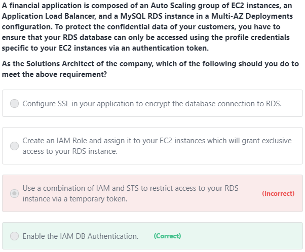

### Explanation

IAM database authentication provides the following benefits:

Network traffic to and from the database is encrypted using Secure Sockets Layer (SSL).

You can use IAM to centrally manage access to your database resources, instead of managing access individually on each DB instance.

For applications running on Amazon EC2, you can use profile credentials specific to your EC2 instance to access your database instead of a password, for greater security

## Question 12

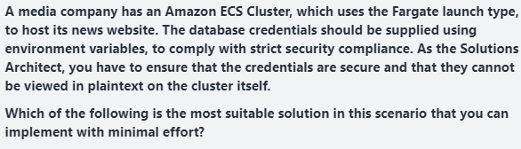

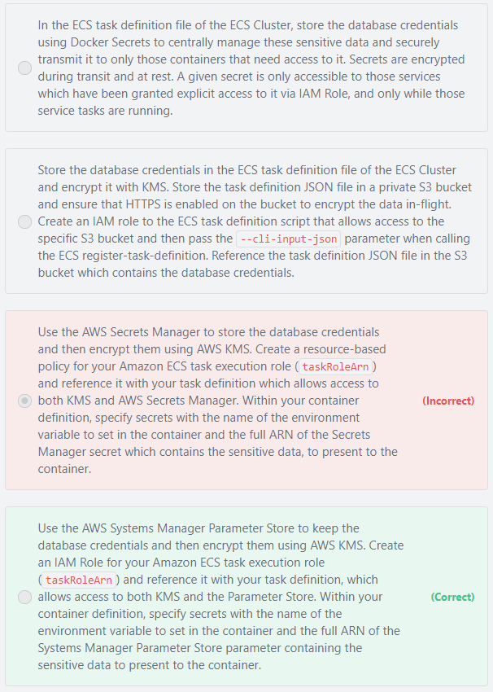

### Explanation

Third option is incorrect because although the use of Secrets Manager in securing sensitive data in ECS is valid, **using an IAM Role is a more suitable choice over a resource-based policy **for the Amazon ECS task execution role.

## Question 13

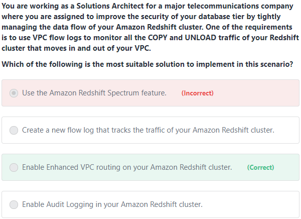

### Explanation

**Enabling Audit Logging in your Amazon Redshift cluster** is incorrect because the Audit Logging feature is primarily used to get the information about the connection, queries, and user activities in your Redshift cluster.

**Using the Amazon Redshift Spectrum feature** is incorrect because this is primarily used to run queries against exabytes of unstructured data in Amazon S3, with no loading or ETL required.

**Creating a new flow log that tracks the traffic of your Amazon Redshift cluster** is incorrect because, by default, you cannot create a flow log for your Amazon Redshift cluster. You have to enable Enhanced VPC Routing and set up the required VPC configuration.

### From

Databases in AWS

Chapter: Redshift (last point in picture)

## Question 14

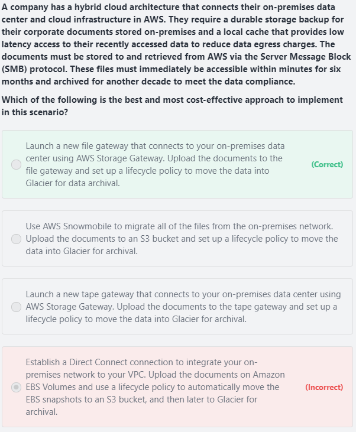

### Explanation

File Gateway: Configured S3 buckets are accessible using **NFS** and **SMB** protocol,most recently used data is cached in the File Gateway

Volume Gateway: Block storage using **iSCSI** protocol backed by S3

Tape Gateway: **Virtual Tape Library (VTL)** backed by S3 and Glacier

**Establish a Direct Connect connection to integrate your on-premises network to your VPC. Upload the documents on Amazon EBS Volumes and use a lifecycle policy to automatically move the EBS snapshots to an S3 bucket, and then later to Glacier for archival** is incorrect because EBS Volumes are not as durable compared with S3 and it would be more cost-efficient if you directly store the documents to an S3 bucket. An alternative solution is to use AWS Direct Connect with AWS Storage Gateway to create a connection for high-throughput workload needs, providing a dedicated network connection between your on-premises file gateway and AWS. But this solution is using EBS, hence, this option is still wrong

### From

AWS Storage Extras

Chapter: Storage Gateway

## Question 15

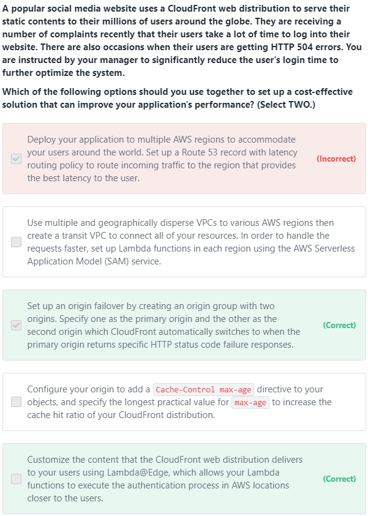

### Explanation

In the given scenario, you can use Lambda@Edge to allow your Lambda functions to customize the content that CloudFront delivers and to execute the authentication process in AWS locations closer to the users. 

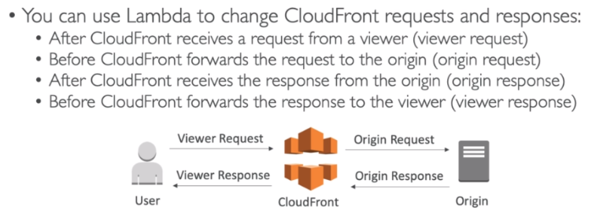

**Deploy your application to multiple AWS regions to accommodate your users around the world. Set up a Route 53 record with latency routing policy to route incoming traffic to the region that provides the best latency to the user** is incorrect because although this may resolve the performance issue, this solution entails a significant implementation cost since you have to deploy your application to multiple AWS regions. Remember that the scenario asks for a solution that will improve the performance of the application with **minimal cost**.

### From

Serverless

Chapter: Lambda @ Edge

CloudFront & AWS Global Accelerator

Chapter: Origins

## Question 16

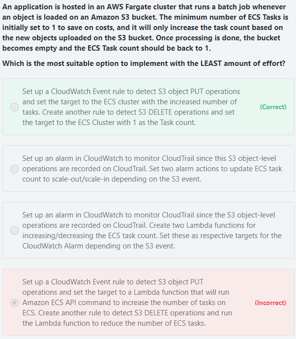

### Explanation

The option that says: **Set up a CloudWatch Event rule to detect S3 object PUT operations and set the target to a Lambda function that will run Amazon ECS API command to increase the number of tasks on ECS. Create another rule to detect S3 DELETE operations and run the Lambda function to reduce the number of ECS tasks** is incorrect because although this solution meets the requirement, creating your own Lambda function for this scenario is not really necessary. It is much simpler to control ECS task directly as target for the CloudWatch Event rule. Take note that the scenario asks for a solution that is the easiest to implement.

You can use CloudWatch Events to run Amazon ECS tasks when certain AWS events occur. You can set up a CloudWatch Events rule that runs an Amazon ECS task whenever a file is uploaded to a certain Amazon S3 bucket using the Amazon S3 PUT operation. You can also declare a reduced number of ECS tasks whenever a file is deleted on the S3 bucket using the DELETE operation.

## Question 17

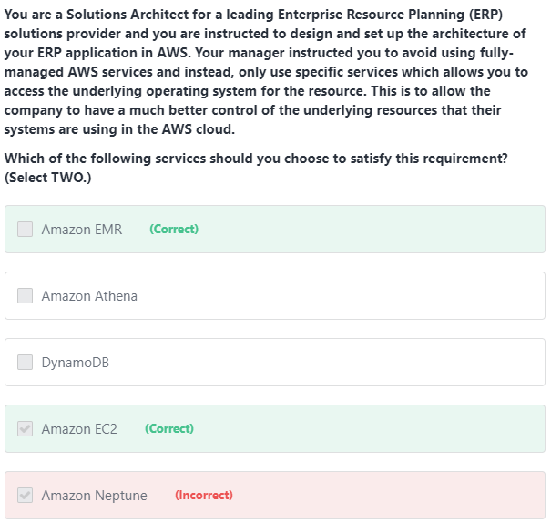

### Explanation

**Amazon EC2** provides you access to the operating system of the instance that you created.

**Amazon EMR** provides you a managed Hadoop framework that makes it easy, fast, and cost-effective to process vast amounts of data across dynamically scalable Amazon EC2 instances. You can access the operating system of these EC2 instances that were created by Amazon EMR.

**Amazon Athena**, **DynamoDB**, and **Amazon Neptune** are incorrect as these are managed services, which means that AWS manages the underlying operating system and other server configurations that these databases use.

## Question 18

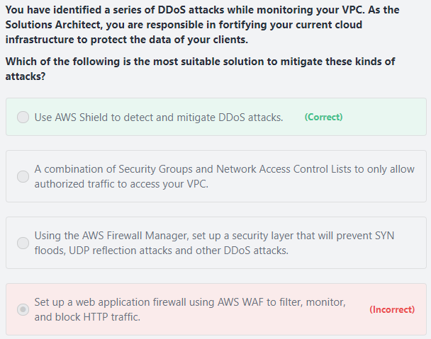

### Explanation

**Shield** : DDoS Protection,free service for every AWS customer (layer 3/  layer 4 => TCP)

**Advanced Shield** : Protect against more sophisticated attack on Amazon EC2, Elastic Load Balancer, Amazon CloudFront, AWS Global Accelerator and Route 53

**WAF**: Protects your web applications from common web exploits (layer 7 => HTTP), deploy on ALB,API Gateway,CloudFront

**Firewall Manager**: Manage rules in all accounts of an AWS Organization

**Using the AWS Firewall Manager, set up a security layer that will prevent SYN floods, UDP reflection attacks and other DDoS attacks** is incorrect because the AWS Firewall Manager is mainly used to simplify your AWS WAF administration and maintenance tasks across multiple accounts and resources. It does not protect your VPC against DDoS attacks.

**Set up a web application firewall using AWS WAF to filter, monitor, and block HTTP traffic** is incorrect because even though AWS WAF can help you block common attack patterns to your VPC such as SQL injection or cross-site scripting, this is still not enough to withstand DDoS attacks. It is better to use AWS Shield in this scenario.

**A combination of Security Groups and Network Access Control Lists to only allow authorized traffic to access your VPC** is incorrect because although using a combination of Security Groups and NACLs are valid to provide security to your VPC, this is not enough to mitigate a DDoS attack. You should use AWS Shield for better security protection.

### From

AWS Security & Encryption

Chapter: Shield - DDoS Protection,Web Application Firewall (WAF),Firewall Manager