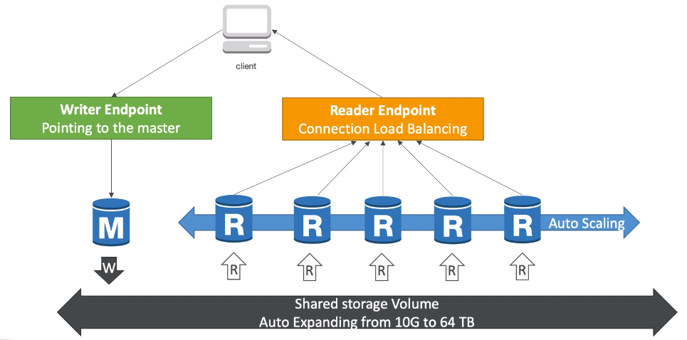

# RDS Aurora ElastiCache

## RDS overview

relational database service

- It's a managed DB service for DB use SQL as query language
- Allow to create db in the cloud and managed by AWS
  - Postgres
  - MySQL
  - MariaDB
  - Oracle
  - Microsoft SQL Server
  - Amazon Aurora
- Advantage
  - RDS is a managed service
    - Automated provisioning, OS patching
    - Continuous backups and restore to specific timestamp (Point in Time Restore)
    - Monitoring dashboards
    - Read replicas for improved read performance
    - Multi AZ setup for Disaster Recovery
    - Maintenance windows for upgrades
    - Scaling capability (vertical and horizontal)
    - Storage backed by EBS (gp2 or iol)
    - <u>**BUT**</u>,you cannot SSH into your RDS instances
- RDS Backups
  - Backups are automatically enables in RDS
  - Automated backups:
    - Daily full backup of the database (during the maintenance window)
    - Transaction logs are backed-up by RDS every 5 minutes
    - Thus,ability to restore to any point in time (from the oldest backup to 5 minutes ago)
    - 7 days retention (can be increased to 35 days)
  - DB snapshots:
    - Manually triggered by the user
    - Retention of backup for as long as you want

## RDS Read Replicas vs Multi AZ

- RDS Read Replicas

  - Up to 5 Read Replicas

  - Within,Cross AZ or Cross Region

  - Replication is ASYNC so reads are eventually consistent

  - Replicas can be promoted to their own DB

  - Applications must update the connection string to leverage Read Replicas

  - Example:

  - Network cost

    

    

    **RDS Multi AZ** (Disaster Recovery)

    - SYNC replication
    - One DNS name - automatic app failover to standby
    - Increase availability
    - Failover in case of loss of AZ,loss of network,instance or storage failure
    - No manual intervention in apps
    - Not used for scaling
    - <u>Read Replicas **can be** setup as Multi AZ for Disaster Recovery</u>
    - 

    ## RDS Encryption and Security

    - Encryption
      - At rest encryption
        - Possibility to encrypt the master & read replicas with AWS KMS
        - Encryption has to be defined at launch time
        - <u>If the master is not encrypted,the read replicas **cannot** be encrypted</u>
        - Transparent Data Encryption available for Oracle and SQL server
      - In-flight encryption
        - SSL certificates to encrypt data to RDS in flight
        - Provide SSL options with trust certificate when connection to database
        - To enforce SSL:
          - PostgreSQL: rds.force_ssl = 1 in the AWS RDS console
          - MySQL: within DB: GRANT USAGE ON *.* TO ;mysqluser`@`%` REQUIRE SSL 
    - Security
      - Network Security
        - RDS databases are usually deployed within a private subnet,not in a public one
        - RDS security works by leveraging security groups (the same concept as for EC2 instances)
      - Access Management
        - IAM policies help control who can manage AWS RDS (through RDS API)
        - Traditional Username and Password can be used to login into the db
        - IAM-based authentication can be used to login into RDS MySQL and PostgreSQL
          - 

    

    ## Amazon Aurora

    - Aurora is a proprietary technology from AWS (not open source)

    - Postgres and MySQL are both supported as Aurora DB (that means your drivers will works as if Aurora was a Postgres or MySQL database)

    - Aurora is 'AWS cloud optimized' and claims 5x performance improvement  than MySQL and 3x than Postgres

    - Aurora storage automatically grows in increments of 10 GB,up to 64TB

    - Aurora can have 15 replicas while MySQL has 5,and the replication process is faster (sub 10 ms replicas lag)

    - Failover in Aurora is instantaneous. It's HA native

    - Aurora costs more than RDS

    -  High Availability and Read Scaling

      - 

    - Aurora DB cluster

      

    - Aurora security

      

      It is exact same as RDS

    - Aurora Serverless

      

    - Global Aurora

      

    
## ElasticCache

The same way RDS is to get managed Relational Databases
    
ElastiCache is to get managed Redis or Memcached
    
Caches are in-memory databases with really high performance,low latency
    

Helps reduce load off of databases for read intensive workloads
    
Helps make your application stateless

<u>Write Scaling using **sharding**</u> 

<u>Read Scaling using **Read Replicas**</u> 

<u>Multi AZ with Failover Capability</u>  

AWS takes care of OS maintenance/ patching,optimizations,setup,configuration,monitoring,failure recovery and backups

**DB Cache**

**User Session Store**

### Redis Vs Memcached

Redis:

- Multi AZ with Auto-Failover

- Read Replicas to scale reads and have high availability

- Data Durability using AOF persistence

- Backup and restore features

- really like normal RDS

- 

  

  

  Memcached:

  - Multi-node for partitioning of data (sharding)
- Non persistent
  
  - No backup and restore
- Multi-threaded architecture
  
  - 

### Cache Security 

All caches in ElastiCache

- Support SSL in flight encryption
- <u>**Do not support IAM authentication**</u>
- IAM policies on ElastiCache are only used for AWS API-level security (creating a cluster,deleting a cluster ,updating the configurations)

Redis AUTH

- You can set a "password/token" when you create a Redis cluster
- This is an extra level of security for your cache(on the top of SG)

Memcached

- Supports SASL-based authentication(advanced)

 

