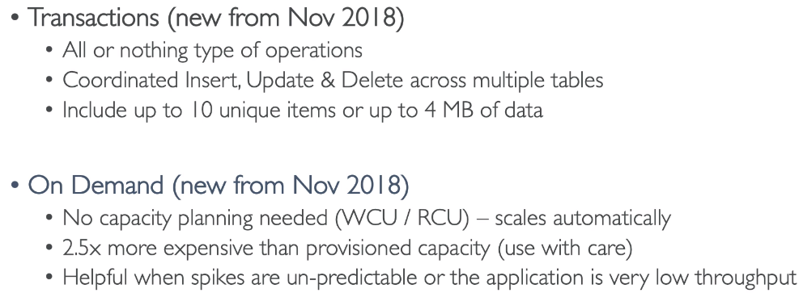

# Serverless Overview

## What is serverless?

- Serverless is a new paradigm in which the developers don't have to manage server anymore
- They just deploy code (function)
- Initially Serverless == FaaS(function as a Service)
- Serverless was pioneered by AWS Lambda but now also includes anything that's managed:"databases,messaging,storage,etc"
- **Serverless does not mean there are no servers"** => it means **you just don't manager / provision / see them **

## Serverless in AWS

- AWS Lambda & Step Functions
- DynamoDB
- AWS Cognito
- AWS API Gateway
- Amazon S3
- AWS SNS & SQS
- AWS Kinesis
- Aurora Serverless

## Lambda 

### Amazon EC2  Vs AWS Lambda

- EC2
  - Virtual **Servers** in the cloud
  - Limited by RAM and CPU
  - Continuously running
  - Scaling means intervention to add / remove servers
- Lambda
  - Virtual **functions** - <u>no servers to manage</u>
  - Limited by time - **short executions**
  - Run **on-demand**
  - **Scaling is automated**

### Example: Serverless Thumbnail Creation

### Example: Serverless CRON Job

### Lambda Limits

- Execution
  - Memory allocation: 128 MB - 3008 MB (64 MB increments)
  - Maximum  execution time: 300 sec - 5 mins (new 15 mins)
  - Disk capacity in the "function container" (in /tmp): 512 MB
  - Concurrency limits: 1000
- Deployment
  - Lambda function deployment size (compressed .zip): 50 MB
  - Size of uncompressed deployment (code + dependencies): 250 MB
  - Can use the /tmp directory to load other files at startup
  - Size of environment variables: 4KB

### Lambda @ Edge

You have deployed a CDN using CloudFront

What if you wanted to run a global AWS Lambda alongside? Or how to implement request filtering before reaching your application?

**Lambda @ Edge**:

- **Deploy Lambda functions alongside your CloudFront CDN**
- Build more responsive applications
- You do not manage servers,Lambda is deployed globally
- Customize the CDN content
- Pay only for what you use

Global application:

## Dynamo DB

- Fully Managed,high available with replication across **3 AZ**
- NoSQL database 
- Scales to massive workloads,distributed database
- Millions of requests per seconds,trillions of row,100 s of TB of storage
- Fast and consistent in performance (low latency on retrieval)
- Integrated with IAM for security,authorization and administration
- Enables event driven programming with DynamoDB Streams
- Low cost and auto scaling capabilities

### Basics

- DynamoDB is made of **tables**
- Each table has a **primary key** (must be decided at creation time)
- Each table can have an infinite number of items (= rows)
- Each item has attributes (can be added over time - can be null)
- Maximum size of a item is **400 KB**
- Data types supported are:
  - Scalar Types: String,Number,Binary,Boolean,Null
  - Document Type: List,Map
  - Set types: String set,Number set,Binary set

### Provisioned Throughput

### DynamoDB - DAX

### DynamoDB Streams

### DynamoDB New Features:

### Security & Other Features

## API Gateway

### API Gateway Integrations

### API Gateway Security

- IAM permissions

  

  **Advantages**: no addition cost

  **Disadvantage**: if you give access to users outside of AWS, IAM permission cannot be used

- Lambda Authorizer (formerly Custom Authorizers)

  

- Cognito User Pools

  

**Summary**:

## AWS Cognito

### Cognito User Pools

### Federated Identity Pools

### Cognito Sync

## Serverless Application Model (SAM)

