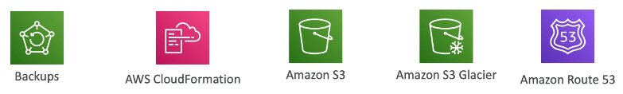

# White Papers and Architectures

## Well Architected Framework General Guiding Principles

### 5 Pillars

**They are not something to balance, or trade-offs,they're a synergy**

### Well Architected Framework

## 1st pillar: Operational Excellence

### On AWS

#### Prepare

#### Operate

#### Evolve

## 2nd pillar: Security

### On AWS

#### Identity and Access Management

#### Detective Controls

#### Infrastructure Protection

#### Data Protection

#### Incident Response

## 3rd: Reliability

### On AWS

#### Foundations

#### Change Management

#### Failure Management

## 4th pillar: Performance Efficiency

### On AWS

#### Section

#### Review

#### Monitoring

#### Trade-offs

## 5th pillar: Cost Optimization

### On AWS

#### Expenditure Awareness

#### Cost-Effective Resources

#### Matching supply and demand

#### Optimizing Over Time

## AWS Trusted Advisor

**You can set weekly notification in Trusted Advisor**

## Example of Architecture

